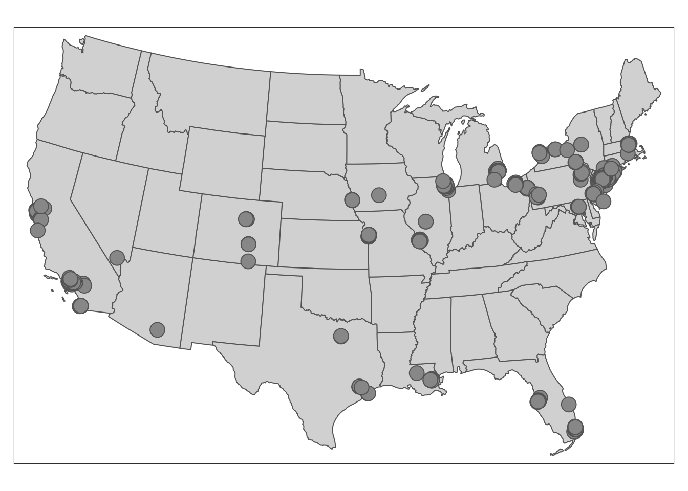
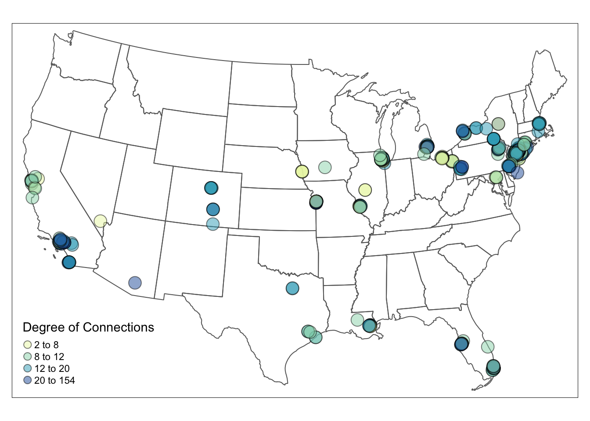
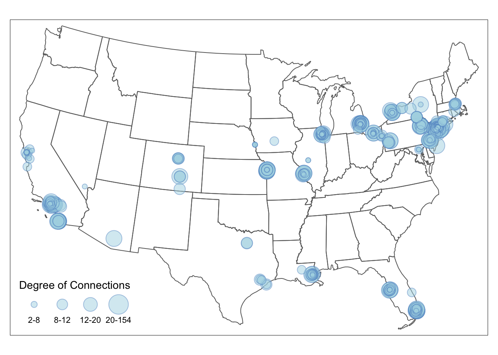
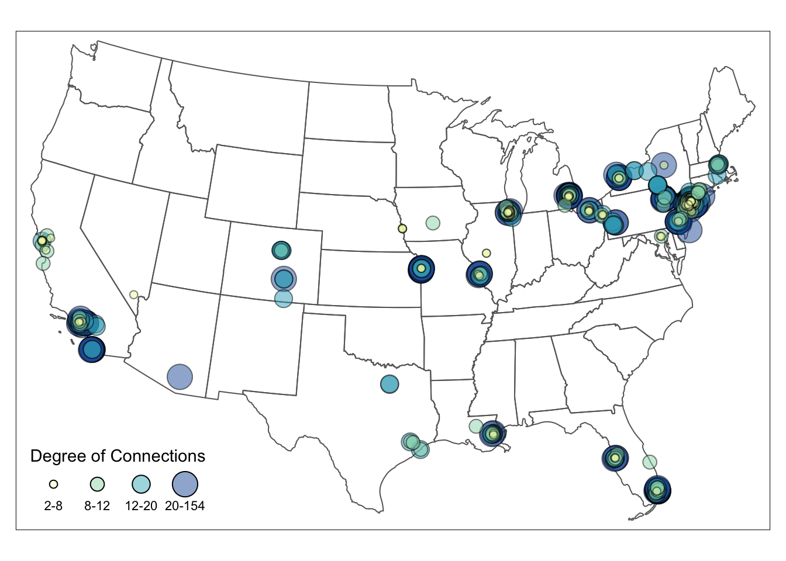

# Visualizing Nodes {#nodes}

In this chapter, we continue to use the American Mafia data introduced in Chapter 2. They can be loaded from the `SSNtools` package directly. 

The node table **MafiaNodes** contains:

* `NODE`: Name of the Mafia member (capitalized)
* `Family`: Mafia family the member belongs to 
* `NY`: Whether the member is in New York City
* `LonX`: Longitude of the location of the member
* `LatY`: Latitude of the location of the member 
* `NiceLabel`: Name of the Mafia member (lower case)

The edge list **MafiaEdges** contains pairs of undirected connections:

* `Source`: the name of a member
* `Target`: the name of a different member

This chapter covers the following topics: 

* How to convert node coordinates into point geometry
* How to visualize nodes with constant color and size 
* How to visualize nodes with varying node size by attributes 
* How to visualize nodes with varying color by attributes
* How to visualize nodes with varying node size and color with a combined legend 

You will be able to find a copy of all the codes at the bottom of the page.

```{r echo=FALSE, fig.cap="", out.width = '50%', fig.show = "hold"}




```

Before proceeding to the codes, please load the following packages:
```{r, message=FALSE, eval=TRUE}
library(sf)
library(tidyverse)
library(tmap)
library(igraph)
library(RColorBrewer)
library(tigris)
#install.packages("devtools") #to download R package on GitHub
#devtools::install_github("friendlycities-gatech/SSNtools")
library(SSNtools)
``` 

## Convert Coordinates to Points

The data for the nodes may come in two common format. One is the node table that we mentioned in Chapter 2 (REF), and the other is spatial object, in which nodes are already point geometry. The **node table** often stores the spatial information of the node as two columns: `latitude` and `longitude`. **Spatial object** contains spatial information of the node in the `geometry` column. It also includes projection coordinates system of the object. Unless you are working with `ggplot2`, most other visualization packages require nodes to be spatial objects for mapping. 

You can convert a node table with coordinates into a spatial object with `st_as_sf` function in `sf` package. Spatial information is stored in the **LonX** and **LatY** column in `MafiaNodes` node table. Therefore, when we convert it to `sf` spatial object, we need to set the coordinates crs to be *WGS84* (4326).

```{r spatialobject, message=FALSE, eval=TRUE}
#MafiaNodes is a built-in dataset in SSNtools R package
data(MafiaNodes)

MafiaSpatial = MafiaNodes %>% 
  st_as_sf(coords=c("LonX", "LatY"), crs = 4326) 

head(MafiaSpatial, 3)
```

## Visualize Nodes

**First step**, we download the U.S. state shapefile through `tigris` package as the background for visualization and transform the shapefile and the dataframe data to the appropriate crs (coordinate reference system). 

The coordinate information can be stored in other projection system other than the commonly used WGS84. Users need to find out what crs is used before transforming the data to another system. Only when crs are the same for two or more shapefiles (or geometry) can we overlay them correctly on each other. Since we are mapping the data on U.S. mainland, we exclude U.S. territories and further transform the node table into `sf` spatial objects with *North America Equidistant Conic projection* (crs="ESRI:102010"). 

```{r message=FALSE, warning=FALSE, eval=TRUE}
#Convert coordinate system
MafiaSpatial = MafiaSpatial %>%
  st_transform(MafiaSpatioal, crs="ESRI:102010")

#states is a function in tigris to download U.S. state boundary shapefile
us_states = states(cb=TRUE, progress_bar = FALSE) %>%
  filter(!STUSPS %in% c('PR','AS', 'AK', 'GU','MP','VI', 'HI')) %>%
  st_transform(crs="ESRI:102010")
```

**Second step**: visualize the nodes on the US state map! 
```{r message=FALSE, warning=FALSE, eval=TRUE}
tmap_mode('plot') # set tmap plotting mode to static map 
tm_shape(us_states) +  
  tm_polygons() + #draw U.S. state shapefile first as polygons
  tm_shape(MafiaSpatial) + 
  tm_symbols() #overlay nodes as points
```

## Visualize Nodes by Node Color
The map above only shows the locations of Mafia members. We want to visualize the influence of these members and find out where influential people reside. We load the edge file `MafiaEdges` and calculate the degree of each node.

**To vary the node color by degree**, we simply set the `col` argument to the variable `degree` that should vary by color. Different from node size, `style` argument can modulate the breaks for node color in different styles, such as quantile breaks, equal interval breaks, head/tail breaks and so on. The number of class is defaulted to five. To define the color, you can either pass a R palette (e.g., `YlGnBu`) or a vector of color to `palette` argument. More details can be found in `tmap` [document](https://cran.r-project.org/web/packages/tmap/tmap.pdf).  

```{r message=FALSE, warning=FALSE, eval=TRUE}
#MafiaEdges is a built-in dataset in SSNtools
#Construct a network and calculate the degree for each node. 
g = graph_from_data_frame(MafiaEdges, directed = FALSE, vertices=MafiaSpatial)
MafiaSpatial$degree = degree(g)

tmap_mode('plot')
tm_shape(us_states) +
  tm_polygons(alpha=0) +
  tm_shape(MafiaSpatial) +
  tm_symbols(
    size=1, #constant node size
    col='degree', palette = 'YlGnBu', #define which numeric column to vary by color and the color palette
    style='quantile', n = 4, #define the color breaks using quantile, and set the number of classes to 4.
    alpha=0.5, border.col='black', border.alpha = 0.5,
    title.col=c('Degree of Connections'))
```

## Visualize Nodes by Node Size
**To visualize the node size by the connection degree**, we have to set the node size varies by degree in `tm_symbols`. The default breaks for node size is interval breaks. You can adjust the breaks for node size in the legend directly through `sizes.legend` argument in `tm_symbols`.

```{r message=FALSE, warning=FALSE, eval=TRUE}
# Visualize 
tmap_mode('plot')
tm_shape(us_states) +
  tm_polygons(alpha=0) + #turn the background color of the polygons to transparent
  tm_shape(MafiaSpatial) +
  tm_symbols(size="degree", scale=2, #scale up the node size 
             col='lightblue', border.col='#6698CC', 
             title.size=c('Degree of Connections'))
```

<!-- One challenge for this map (and others that visualize nodes) is that there are too many nodes cluster at nearby locations, which makes it difficult for people to find the most influential people and see the distribution of the nodes. One solution is to adjust the breaks of the node size and add color to breaks so that the influential nodes can stand out more. Another solution is to create an inset map for New York City area where the nodes are most cluttered (see Chapter5).  -->

**If you want node size to follow a particular break, then nodes need to be grouped into size brackets**. Differnt from color whose breaks can be adjusted in `style` argument (e.g., style='quantile'), changing node size is not straightforward. This example shows how to size nodes in quantile breaks. We first check the quantile breakdown of the degree in the data as the reference. Then, we create a new `degree_brackets` column that group nodes with different degree to ordered categories. Lastly, we set the `size` argument in `tm_symbols` to the new `degree_brackets` column, which changes the size of the nodes in the map. We adjust the legend breaks using `sizes.legend`. `sizes.legend` only changes the size of the nodes in the legend but not for nodes in the map (use scale for the latter). More details can be found in `tmap` [document](https://cran.r-project.org/web/packages/tmap/tmap.pdf).

**The final node size in the map = relative node size defined in `degree_brackets` / `size.max` * `scale`**

Numbers in the `degree_brackets` column only define the relative size difference between the nodes. `size.max` and `scale` are often defaulted to be 1, therefore makes it easy for people to directly define node size in the `degree_brackets` column. In that case, the node with designated with the highest size value will have the node size of 1. In our example, node size of 1 is visually too small in the map, so we scale up the node size by 1.5. Thus, the actual node sizes for the four brackets are c(0.1, 0.3, 0.5, 1)/1*1.5 = c(0.15, 0.45, 0.75, 1.5). 

```{r message=FALSE, warning=FALSE, eval=TRUE}
quantile(MafiaSpatial$degree)

# Create a new 'degree_bracket' column that contains the node size for each group of nodes. 
MafiaSpatial = MafiaSpatial %>%
  mutate(degree_brackets = case_when(
    degree >= 2 & degree < 8 ~ 0.1,
    degree >= 8 & degree < 12 ~ 0.3, 
    degree >= 12 & degree < 20 ~ 0.5,
    degree >= 20 & degree <= 154 ~ 1
  ))

# Visualize
tmap_mode('plot')
tm_shape(us_states) +
  tm_polygons(alpha=0) +
  tm_shape(MafiaSpatial) +
  tm_symbols(
    size="degree_brackets", size.max = 1, scale = 1.5,
    sizes.legend = c(0.1, 0.3, 0.5, 1)/1*1.5,
    sizes.legend.labels = c('2-8','8-12','12-20','20-154'),
    col='lightblue', border.col='#6698CC', #blue grey
    alpha=0.5, border.alpha = 0.5, 
    title.size=c('Degree of Connections'))
```

## Visualize Nodes by Size and Color
The automatic legend in tmap now cannot support color and size legend in one. **To combine the color and size legend**, we have to manually create a legend with the color and size attributes from the color and size legends, using `tm_add_legend`. To replicate the color, we use `RColorBrewer` package to generate colors for a given number, which is the default way that `tmap` assigns colors. To replicate the size, we pass in the square root of the actual node size. Setting node size in `tm_add_legend` is tricky, which is the square roots of the actual node size (see [here](https://github.com/mtennekes/tmap/issues/451) for detail explanation). Remember: **The final node size in the map = relative node size defined in `degree_brackets` / `size.max` * `scale`**. Lastly, we set the `legend.col.show =FALSE` and `legend.size.show =FALSE` to hide the default legends.

```{r message=FALSE, warning=FALSE}
tmap_mode('plot')
map = tm_shape(us_states) +
  tm_polygons(alpha=0) +
  tm_shape(MafiaSpatial) +
  tm_symbols(
    #arguments that define point sizes 
    size="degree_brackets", size.max = 1, scale = 1.5,
    legend.size.show = FALSE,
    #arguments that define point colors 
    col='degree_brackets', palette = 'YlGnBu', n = 4,
    alpha=0.5, 
    border.col='black', border.alpha = 0.5,
    legend.col.show = FALSE) +
  tm_add_legend(type=c("symbol"),
                col = c("#FFFFCC", "#A1DAB4", "#41B6C4", "#225EA8"), #copy from RColorBrewer: brewer.pal(4, "YlGnBu")
                alpha = 0.5, is.portrait = FALSE, # legend becomes horizontal
                # size defined here should be the square root of the normalized point size * scale. 
                # The square root is taken since the area is proportional to the data, not the radius.
                size = (c(0.1,0.3,0.5,1)/1)^0.5*1.5, 
                labels = c('2-8','8-12','12-20','20-154'), #break labels 
                border.col = 'black', border.alpha = 0.2,
                title = c("Degree of Connections"))

map
```

To export the tmap object into a local folder, you can add:
```{r, message=FALSE, warning=FALSE, eval=FALSE}
tmap_save(map, filename='YOUR_LOCAL_FOLDER_PATH/map.png')
```

The full codes for creating the map above is in the following: 
```{r message=FALSE, warning=FALSE}
library(readr)
library(igraph)
library(tmap)
library(sf)
library(tidyverse)
library(RColorBrewer)
library(SSNtools)

#read data
MafiaSpatial = MafiaNodes %>% 
  st_as_sf(coords=c("LonX", "LatY"), crs = 4326) 

us_states = states(cb=TRUE, progress_bar=FALSE) %>%
  filter(!STUSPS %in% c('PR','AS', 'AK', 'GU','MP','VI', 'HI')) %>%
  st_transform(crs="ESRI:102010")

# Construct a network and calculate the degree for each node.
g = graph_from_data_frame(MafiaEdges, directed = FALSE, vertices=MafiaSpatial)
MafiaSpatial$degree = degree(g)

# Create a new column that assign point size to points with varying degree.
MafiaSpatial = MafiaSpatial %>%
  mutate(degree_brackets = case_when(
    degree >= quantile(MafiaSpatial$degree)[1] & degree < quantile(MafiaSpatial$degree)[2] ~ 0.1,
    degree >= quantile(MafiaSpatial$degree)[2] & degree < quantile(MafiaSpatial$degree)[3] ~ 0.3,
    degree >= quantile(MafiaSpatial$degree)[3] & degree < quantile(MafiaSpatial$degree)[4] ~ 0.5,
    degree >= quantile(MafiaSpatial$degree)[4] & degree <= quantile(MafiaSpatial$degree)[5] ~ 1
  ))

# Visualize
tmap_mode('plot')
map = tm_shape(us_states) +
  tm_polygons(alpha=0) +
  tm_shape(MafiaSpatial) +
  tm_symbols(
    #arguments that define point sizes
    size="degree_brackets", size.max = 1, scale = 1.5,
    legend.size.show = FALSE,
    #arguments that define point colors
    col='degree', palette = 'YlGnBu', style='quantile', n = 4,
    alpha=0.5,
    border.col='black', border.alpha = 0.5,
    legend.col.show = FALSE) +
  tm_add_legend(type=c("symbol"),
                col = brewer.pal(4, "YlGnBu"), #copy the color from R palette
                alpha = 0.5, is.portrait = FALSE, # legend becomes horizontal
                # size defined here should be the sqaure root of the normalized point size * scale.
                # The square root is taken since the area is proportional to the data, not the radius.
                size = (c(0.1,0.3,0.5,1)/1)^0.5*1.5,
                labels = c('2-8','8-12','12-20','20-154'), #break labels
                border.col = 'black', border.alpha = 0.2,
                title = c("Degree of Connections"))

#tmap_save(map, filename='YOUR_LOCAL_FOLDER_PATH/map.png')
```

<!-- ## Visualize Multiple Node Attributes -->

<!-- In the American Mafia example, we only visualize nodes with one attribute. What if we want to compare multiple attributes of a node? We use the remittance network data between countries as an example to show: -->

<!-- * Visualize multiple node attributes by size  -->
<!-- * Visualize multiple node attributes by size and color  -->

<!-- The remittance network data comes from [World Bank](https://www.worldbank.org/en/topic/migrationremittancesdiasporaissues/brief/migration-remittances-data) for the year 2017.   -->

<!-- ## Bounding Box and Inset Maps -->

<!-- ## Interactive mode and Base Maps  -->
