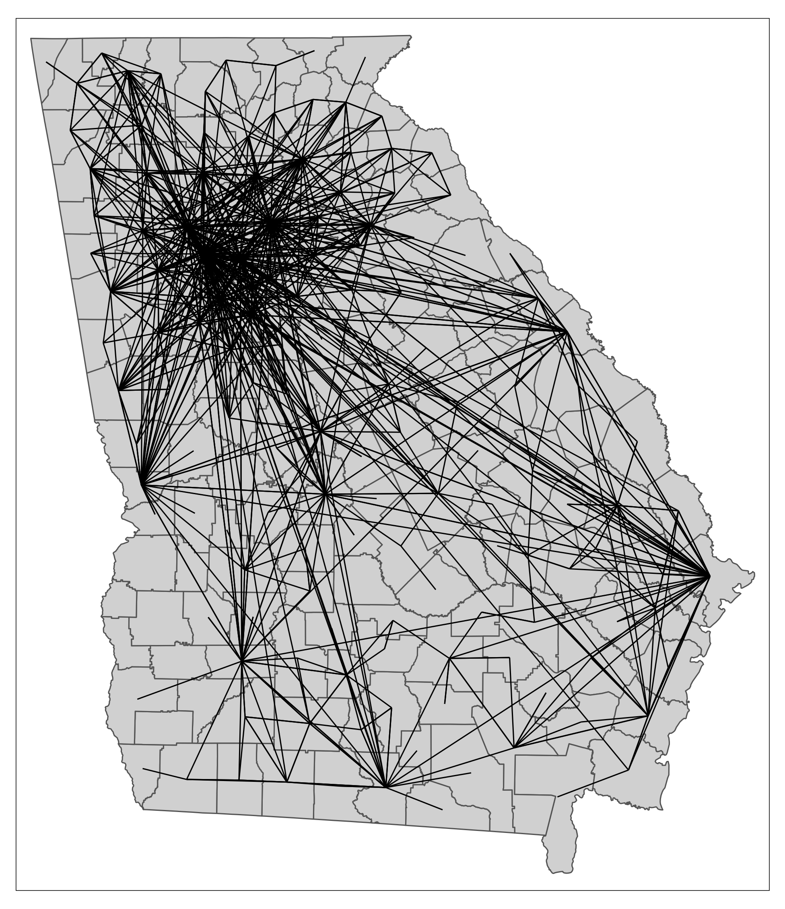
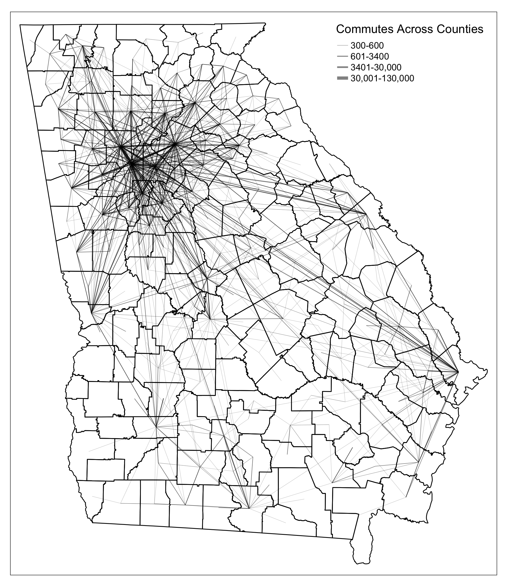
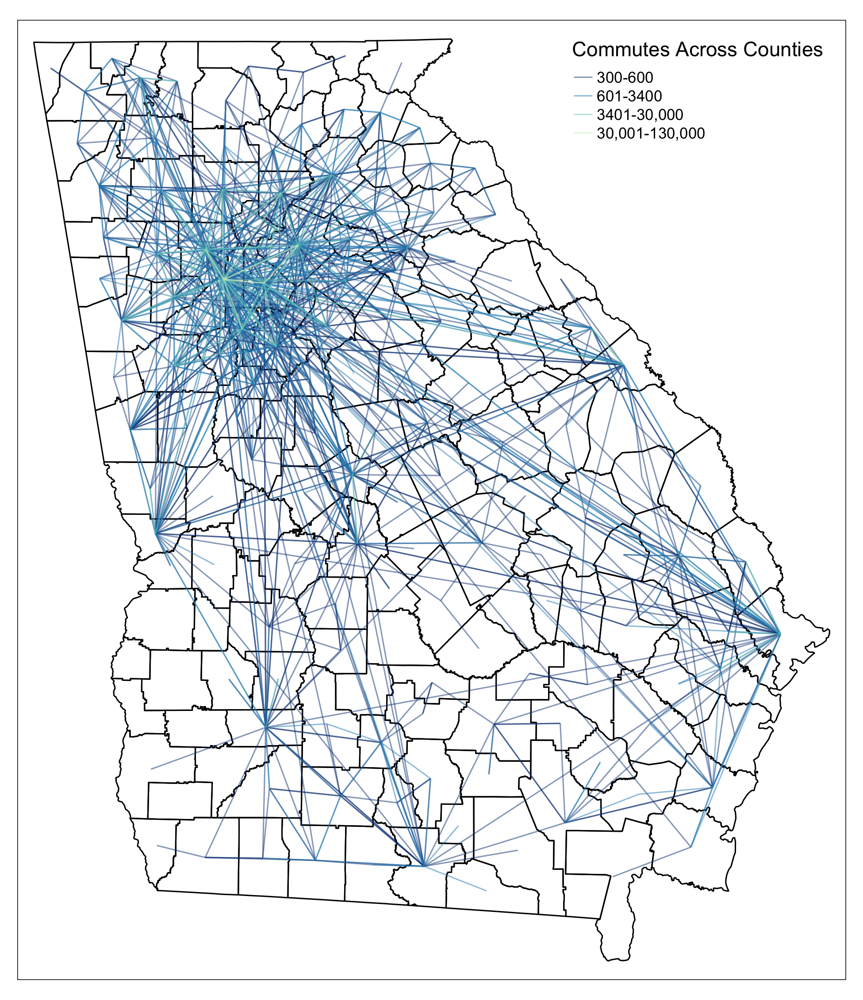
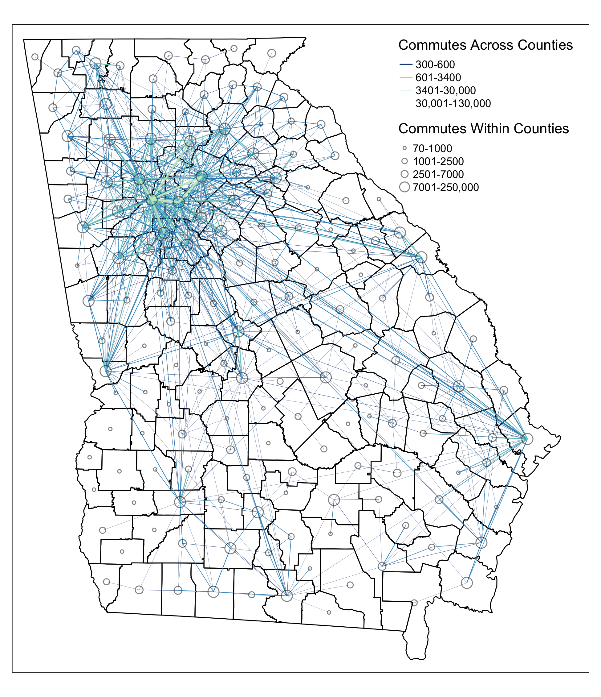

# Visualizing Edges {#vizedges}

In this chapter, we will use commute data from U.S. Census LEHD (Longitudinal Employer-Household Dynamics) Origin-Destination Employment Statistics ([LODES](https://lehd.ces.census.gov/data/)). We will use `lehdr` package to download LODES commute data between counties in Georgia and use `tigris` to download county shapefiles and convert to centroids as points in the spatial networks. 

This chapter covers the following topics: 

* How to convert point data into line geometry 
* How to visualize edges with constant color and size 
* How to visualize edges with varying edge width by attributes 
* How to visualize edges with varying edge color by attributes
* How to visualize edges with varying edge size and edge color with a combined legend 

You will be able to find a copy of all the codes at the bottom of the page.

```{r echo=FALSE, fig.cap="", out.width = '50%', fig.show = "hold"}




```

Before proceeding to the codes, please load the following packages:
```{r, message=FALSE, warning=FALSE, eval=TRUE}
library(sf) #for using spatial objects 
library(tidyverse) #for using tidy syntax 
library(tmap) #for visualizing maps 
library(tigris) #for downloading TIGER boundary shapefiles 
library(lehdr) #for downloading LODES commute data
library(stplanr) #for using od2line function to convert points to lines
``` 

## Convert Points into Lines

To start, we use `lehdr` [package](https://github.com/jamgreen/lehdr) to download LODES commute data between counties in Georgia and use `tigris` [package](https://github.com/walkerke/tigris) to download county shapefiles and convert to centroids as points in the spatial networks. 

```{r, message=FALSE, warning=FALSE, eval=TRUE}
#counties is a function in tigris package
GA_county = counties(state = 'GA', cb=TRUE, year=2018, progress_bar=FALSE) 

#grab_lodes is a function in lehdr package
data = grab_lodes(state='ga', year=2018, lodes_type = 'od', state_part = 'main', agg_geo = 'county')

#filter top 1000 county-to-county flows 
ctc_commutes = data %>% select(c(w_county, h_county, S000)) %>% 
  rename(flow = S000) %>% 
  filter(h_county != w_county) %>% 
  arrange(desc(flow)) %>% 
  slice(1:1000) 

head(ctc_commutes, 3)
```

Columns `h_county` and `w_county` contain the county FIPS (or GEOID) codes. `S000` contains the total number of job flows between the home county and the work county. We also only want to create lines between counties, so we will filter out flows that have the same `h_county` and `w_county`. 

There are THREE ways to convert points into a line geometry. 

### Method 1: Use `od2line` function in `stplanr` package. 

`od2line` takes in an OD dataframe that assumes the first two column contains the origin and destination variables that can be matched to the shapefile. In our case, those are the county GEOID. **This method is particularly useful if you stores your OD dataframe and your shapefiles separately**. This is the easiest way for our dataset to convert into lines. The only downside is you have one more package dependency. We encourage readers to explore other useful OD-related functions in the `stplanr` package, such as `dist_google()`, `od_coords2line()`, `od_to_odmatrix()` and so on.

```{r, message=FALSE, warning=FALSE, eval=TRUE}
library(stplanr)
cnty_centroid = GA_county %>% st_centroid() %>% select(c(GEOID, geometry))
edges = od2line(ctc_commutes, cnty_centroid)
head(edges, 3)
```

### Method 2: Group by lineID and Summarize Points into Line  

The second one is to group the points coordinates by line ID, summarize the flow values, and then use `st_cast` in the `sf` package to turn the grouped point coordinates into a line geometry. **This method is particularly useful if your points are organized by line ID and if you do not want to use extra packages**. It is also convenient GPS trajectory data because each row is a point data associated with a line ID and you want to connect all the points that represent one trajectory. 

For our data, we do not have line ID for points, but we can create such ID with `row_number()`. To leverage method 1, we have to split one OD pair into two rows so that the first row contains the point geometry of the origin and the second row contains the point geometry of the destination. To do that, we perform a little trick: we swap the position of the `h_county` and `w_county` of `ctc_commutes` and bind it to the existing `ctc_commutes` dataframe. Then when we join county shapefiles by `h_county`, we actually join the shapefiles for both the origin county and the destination county. Then we can use the group_by and summarise method to create lines. Noted that column `ID` needs to be created before and during binding the `ctc_commutes`, so that group_by knows which OD is one the same line. You also need to ensure the dataframe is an `sf` object after doing `left_join` through `st_as_sf()`. 

```{r, message=FALSE, warning=FALSE, eval=TRUE}
edges = ctc_commutes %>% 
  mutate(ID = row_number()) %>% 
  bind_rows(ctc_commutes %>% rename(w_county = h_county, h_county = w_county) %>% mutate(ID = row_number())) %>% 
  left_join(GA_county %>% st_centroid() %>% select(c(GEOID, geometry)), by=c('h_county' = 'GEOID'), copy=FALSE) %>% 
  st_as_sf() %>% 
  group_by(ID) %>% 
  summarize(w_county=first(w_county), h_county = first(h_county), flow=mean(flow)) %>%
  st_cast("LINESTRING") 

head(edges, 3)
```

### Method 3: Join Two Point Geometry into One Row and Unite into Line
The third way to convert points into lines is to join two point geometry in one row and cast them into a line. **This method is particularly useful if you have coordinates of both origin and destination points in one dataframe**. In our case, we do not have coordinates, so we have to join `GA_county` to get the geometries to use this method. 

```{r, message=FALSE, warning=FALSE, eval=TRUE}
edges = ctc_commutes %>% 
  left_join(GA_county %>% st_centroid() %>% select(c(GEOID, geometry)), by=c('h_county' = 'GEOID'), copy=FALSE) %>% 
  left_join(GA_county %>% st_centroid() %>% select(c(GEOID, geometry)), by=c('w_county' = 'GEOID'), copy=FALSE) %>% 
  mutate(geometry = st_cast(st_union(geometry.x, geometry.y), "LINESTRING")) %>% 
  select(-c(geometry.x, geometry.y)) %>% st_as_sf()

head(edges, 3)
```

## Visualizing Edges  

The simplest edge visualization code snippet using `tmap` is the following: 

```{r, message=FALSE, warning=FALSE, eval=TRUE}
tmap_mode('plot')
#Visualize edges 
tm_shape(GA_county) + 
  tm_polygons() +
  tm_shape(edges) +
  tm_lines()
```

## Visualizing Edges by Line Width

To visualize edges by line width, we added a column variable `flow` for line width in `tm_lines()`. 

```{r, message=FALSE, warning=FALSE, eval=TRUE}
tmap_mode('plot')
tm_shape(GA_county) + 
  #change polygon background to be transparent
  tm_polygons(alpha=0, border.col = 'black') +
  tm_shape(edges) +
  #define line width and properties associated with lines 
  tm_lines(lwd='flow', scale=10, alpha=0.5, legend.lwd.is.portrait = TRUE,
           title.lwd = c('Commutes Across Counties')) + 
  tm_layout(legend.position = c('right', 'top'),
            inner.margins = c(0.02, 0.02, 0.02, 0.07))
```

The default line width setting is proportional to the column variable (in this case, flow values). As you can see, this default is not a good visualization for the map because edges with small amount of flows are too thin to be seen. In reality, the degree weight distribution of non-planar networks is often skewed, with a few edges have very high flow values and most of the rest have low values. Therefore, we need to adjust the breaks to better visualize the spatial network. 

**To adjust the line width breaks**, we need to create a column to store relative edge width, which is similar to the node size visualization in chapter 2. We chose a skewed quantile breaks for line width.  

```{r, message=FALSE, warning=FALSE, eval=TRUE}
# We design the breaks for edge width through a skewed quantile distribution
brks = round(quantile(edges$flow, probs=c(0, 0.5, 0.9, 0.99, 1)), 0)

# We create a column called flow_breaks that stores relative line width 
edges = edges %>% mutate(
  flow_width = case_when(
    flow >= brks[1] & flow <= brks[2] ~ 0.1,
    flow > brks[2] & flow <= brks[3] ~ 0.3,
    flow > brks[3] & flow <= brks[4] ~ 0.5,
    flow > brks[4] & flow <= brks[5] ~ 1
  )
)

tmap_mode('plot')
tm_shape(GA_county) + 
  tm_polygons(alpha=0, border.col = 'black') + 
  # commute edges are arranged by flow values from high to low so that 
  # high volumn flows will be plotted on the top of the low value ones.  
  tm_shape(arrange(edges, flow)) + 
  tm_lines(lwd="flow_width", scale=2, alpha=0.5,
           lwd.legend = c(0.1, 0.3, 0.5, 1)*2, 
           legend.lwd.is.portrait = TRUE,
           lwd.legend.labels=c('300-600','601-3400',
                               '3401-30,000','30,001-130,000'),
           title.lwd = c('Commutes Across Counties')) + 
  tm_layout(legend.position = c('right', 'top'),
            inner.margins = c(0.02, 0.02, 0.02, 0.05))
```

## Visualizing Edges by Color

To visualize edges by color, we assign a variable column `flow` to argument `col` in `tm_lines`. Since we already established that the edges are better viewed through a skewed flow breaks, we manually assign break values for color. To do that, we give argument `breaks` a vector of fixed numbers, and set argument `style` to `fixed`. The following map has constant line width across different colors. 

```{r, message=FALSE, warning=FALSE, eval=TRUE}
tmap_mode('plot')
tm_shape(GA_county) + 
  tm_polygons(alpha=0, border.col = 'black') + 
  tm_shape(arrange(edges, flow)) + 
  # all the parameters for adjusting colors
  tm_lines(col="flow", alpha=0.5, scale = 1,
           breaks = round(quantile(edges$flow, probs=c(0, 0.5, 0.9, 0.99, 1)), 0),
           style="fixed", n = 4, 
           title.col = c('Commutes Across Counties'),
           labels=c('300-600','601-3400','3401-30,000','30,001-130,000'),
           palette=c('#094081', '#2B8CBE', '#7BCCC4', '#CCEBC5')) + 
  tm_layout(legend.position = c('right', 'top'),
            inner.margins = c(0.02, 0.02, 0.02, 0.05))
```

## Visualizing Edges by Width and Color

Similar to node visualization, to visualize edges with both line width and color, we need to add arguments for both and create a combined legend through `tm_add_legend`. Unfortunately, the package does not have an automatic way to combine color and line width legend together, so we have to define the values manually. 

```{r, message=FALSE, warning=FALSE, eval=TRUE}
tmap_mode('plot')

map = tm_shape(GA_county) + 
  tm_polygons(alpha=0, border.col = 'black') + 
  tm_shape(arrange(edges, flow)) + 
  tm_lines(
    #arguments that define the styles for color 
    col="flow", alpha=0.8, 
    breaks = round(quantile(edges$flow, probs=c(0, 0.5, 0.9, 0.99, 1)), 0),
    style="fixed", n = 4, 
    palette=c('#094081', '#2B8CBE', '#7BCCC4', '#CCEBC5'),
    legend.col.show = FALSE,
    #arguments that define the styles for line width 
    lwd="flow_width", scale=2,
    legend.lwd.show = FALSE) + 
  #add manual legends to combine color and line width schema
  tm_add_legend(
    type=c('line'), 
    col=c('#094081', '#2B8CBE', '#7BCCC4', '#CCEBC5'), 
    lwd=c(1, 0.5, 0.3, 0.1), 
    labels=c('300-600','601-3400','3401-30,000','30,001-130,000'),
    title='Commutes Across Counties') + 
  tm_layout(legend.position = c('right', 'top'),
            inner.margins = c(0.02, 0.02, 0.02, 0.05))
map
```

Perfect! Now we can see clearly that commutes across counties are most intensive around the Atlanta metropolitan area and less so in the south of the state. We can further perfect the map by **adding information about within county flows and visualize the numbers as node sizes**. Here we show a new technique, which is to save the map we already plotted as a variable, and add new components to it. In this way, we do not have to regenerate the portion of the map that we already produced and speed up the mapping and testing time dramatically!  

```{r, message=FALSE, warning=FALSE, eval=TRUE}
# creating nodes as point geometry that represent within county flows 
nodes = data %>% 
  select(c(w_county, h_county, S000)) %>% 
  rename(flow = S000) %>% 
  filter(h_county == w_county) %>%
  left_join(GA_county %>% st_centroid(), by=c('h_county' = 'GEOID'), copy=FALSE) %>% 
  st_as_sf()

# here we use quantile breaks for node size 
brks = quantile(nodes$flow, probs=seq(0, 1, 0.25))
nodes = nodes %>% mutate(
  size = case_when(
    flow >= brks[1] & flow <= brks[2] ~ 0.1,
    flow > brks[2] & flow <= brks[3] ~ 0.3,
    flow > brks[3] & flow <= brks[4] ~ 0.5,
    flow > brks[4] & flow <= brks[5] ~ 1
  )
)

#visualize nodes on top of the map from last section
map = map + 
  tm_shape(nodes) +
  tm_symbols(
    size="size", scale=0.8, 
    alpha=0, border.col='black', border.alpha=0.5, 
    # values in sizes.legend = relative size defined in 'size' column * scale 
    sizes.legend = c(0.1, 0.3, 0.5, 1)*0.8,
    # labels have rounded the break values
    sizes.legend.labels=c('70-1000','1001-2500','2501-7000','7001-250,000'),
    title.size=c('Commutes Within Counties'),
    legend.size.is.portrait = TRUE) +
  tm_layout(legend.position = c('right', 'top'),
            inner.margins = c(0.02, 0.02, 0.02, 0.25)) #added margins to accomodate legends

map
```

To export the tmap object into a local folder, you can add:
```{r, message=FALSE, warning=FALSE, eval=FALSE}
tmap_save(map, filename='YOUR_LOCAL_FOLDER_PATH/map.png')
```

Here is the full code to replicate the map above 

```{r, message=FALSE, warning=FALSE, eval=FALSE}
library(sf)
library(tidyverse)
library(tmap)
library(tigris)
library(lehdr)
library(stplanr)

#counties is a function in tigris package
GA_county = counties(state = 'GA', cb=TRUE, year=2018, progress_bar=FALSE) 

#grab_lodes is a function in lehdr package
data = grab_lodes(state='ga', year=2018, lodes_type = 'od', state_part = 'main', agg_geo = 'county')

#filter top 1000 county-to-county flows 
ctc_commutes = data %>% select(c(w_county, h_county, S000)) %>% 
  rename(flow = S000) %>% 
  filter(h_county != w_county) %>% 
  arrange(desc(flow)) %>% 
  slice(1:1000) 

#--- Create lines from OD dataframe ---# 
cnty_centroid = GA_county %>% st_centroid() %>% select(c(GEOID, geometry))
edges = od2line(ctc_commutes, cnty_centroid)

# --- Convert flows within county into point geometry --- #
nodes = data %>% 
  select(c(w_county, h_county, S000)) %>% 
  rename(flow = S000) %>% 
  filter(h_county == w_county) %>%
  left_join(GA_county %>% st_centroid(), by=c('h_county' = 'GEOID'), copy=FALSE) %>% 
  st_as_sf()

# --- Create Breaks for edge width --- # 
brks = round(quantile(edges$flow, probs=c(0, 0.5, 0.9, 0.99, 1)), 0)

edges = edges %>% mutate(
  flow_width = case_when(
    flow >= brks[1] & flow <= brks[2] ~ 0.1,
    flow > brks[2] & flow <= brks[3] ~ 0.3,
    flow > brks[3] & flow <= brks[4] ~ 0.5,
    flow > brks[4] & flow <= brks[5] ~ 1
  )
)

# --- Create Breaks for node size --- # 
brks2 = quantile(nodes$flow, probs=seq(0, 1, 0.25))
nodes = nodes %>% mutate(
  size = case_when(
    flow >= brks2[1] & flow <= brks2[2] ~ 0.1,
    flow > brks2[2] & flow <= brks2[3] ~ 0.3,
    flow > brks2[3] & flow <= brks2[4] ~ 0.5,
    flow > brks2[4] & flow <= brks2[5] ~ 1
  )
)

# --- Visualize the map ---- # 
tmap_mode('plot')

map = tm_shape(GA_county) + 
  tm_polygons(alpha=0, border.col = 'black') + 
  tm_shape(arrange(edges, flow)) + 
  tm_lines(
    #arguments that define the styles for color 
    col="flow", alpha=0.8, 
    breaks = round(quantile(edges$flow, probs=c(0, 0.5, 0.9, 0.99, 1)), 0),
    style="fixed", n = 4, 
    palette=c('#094081', '#2B8CBE', '#7BCCC4', '#CCEBC5'),
    legend.col.show = FALSE,
    #arguments that define the styles for line width 
    lwd="flow_width", scale=2,
    legend.lwd.show = FALSE) + 
  #add manual legends to combine color and line width schema 
  tm_add_legend(
    type=c('line'), 
    col=c('#094081', '#2B8CBE', '#7BCCC4', '#CCEBC5'), 
    lwd=c(1, 0.5, 0.3, 0.1), 
    labels=c('300-600','601-3400','3401-30,000','30,001-130,000'),
    title='Commutes Across Counties') + 
  #add inner margin to accomodate legend size 
  tm_layout(legend.position = c('right', 'top'),
            inner.margins = c(0.02, 0.02, 0.02, 0.1)) +
  # visualize nodes 
  tm_shape(nodes) +
  tm_symbols(
    size="size", scale=0.8, 
    alpha=0, border.col='black', border.alpha=0.5, 
    # values in sizes.legend = relative size defined in 'size' column * scale 
    sizes.legend = c(0.1, 0.3, 0.5, 1)*0.8,
    # labels have rounded the break values
    sizes.legend.labels=c('70-1000','1001-2500','2501-7000','7001-250,000'),
    title.size=c('Commutes Within Counties'),
    legend.size.is.portrait = TRUE) +
  # since the default layout is too small to accomodate both legends
  tm_layout(legend.position = c('right', 'top'),
            inner.margins = c(0.02, 0.02, 0.02, 0.25))

map

tmap_save(map, filename='YOUR_LOCAL_FOLDER_PATH/map.png')
```
