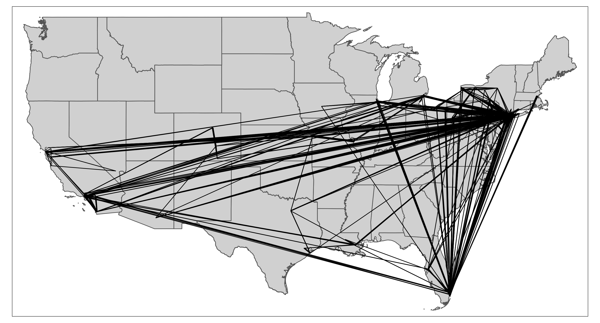
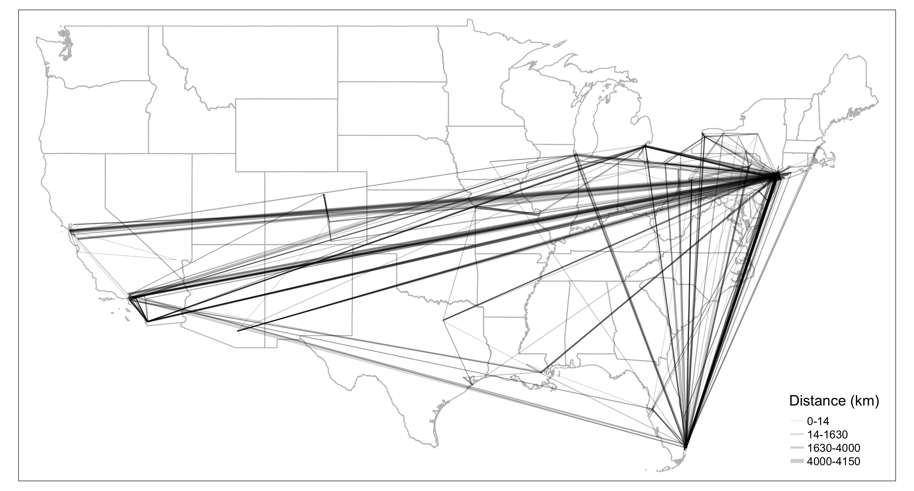
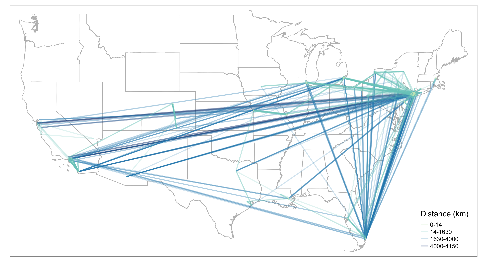
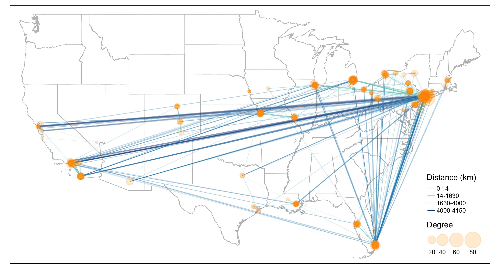

# Visualizing Edges {#vizedges}

In this chapter, we continue to use the American Mafia data introduced in Chapter 2.

This chapter covers the following topics: 

* How to convert point data into line geometry 
* How to visualize edges with constant color and size 
* How to visualize edges with varying edge width by attributes 
* How to visualize edges with varying edge color by attributes
* How to visualize edges with varying edge size and edge color with a combined legend 

You will be able to find a copy of all the codes at the bottom of the page.

```{r echo=FALSE, fig.cap="", out.width = '50%', fig.show = "hold"}




```

Before proceeding to the codes, please load the following packages:
```{r, message=FALSE, warning=FALSE, eval=TRUE}
library(sf) #for using spatial objects 
library(tidyverse) #for using tidy syntax 
library(tmap) #for visualizing maps 
library(tigris) #for downloading TIGER boundary shapefiles 
library(stplanr) #for using od2line function to convert points to lines
library(igraph) #for calculating node degree
library(SSNtools) #load sample datasets MafiaNodes and MafiaEdges
``` 

## Convert Points into Lines
### Method 1: Use `od2line` function in `stplanr` package. 

`od2line` takes in two arguments: 1) an OD dataframe that assumes the first two column contains the origin and destination variables, and 2) a shapefile that can be matched to the origin and destinations. In our case, the first dataframe is **MafiaEdges**, and the second is **MafiaNodes** converted into an sf geometry object. **This method is particularly useful if you stores your OD dataframe and your shapefile separately**. This is also the easiest way for our dataset to convert into lines. The only downside is that you have one more package dependency. We encourage readers to explore other useful OD-related functions in the `stplanr` package, such as `dist_google()`, `od_coords2line()`, `od_to_odmatrix()` and so on.

```{r, message=FALSE, warning=FALSE, eval=TRUE}
#library(SSNtools)
#library(tidyverse)
#library(stplanr)

data(MafiaNodes)
data(MafiaEdges)

# convert MafiaNodes to an sf geometry object (shapefile)
MafiaSpatial = MafiaNodes %>% 
  st_as_sf(coords=c("LonX", "LatY"), crs = 4326) 

# create line geometry 
MafiaEdges_toLine = od2line(MafiaEdges, MafiaSpatial)

# print first three rows 
MafiaEdges_toLine[c(1:3),]
```

### Method 2: Group by lineID and Summarize Points into Line  

The second one is to group the points coordinates by line ID, summarize the geometry (you can also flow values in the same statement if available), and then use `st_cast` in the `sf` package to turn the grouped point coordinates into a line geometry. **This method is particularly useful if your points are organized by line ID and if you do not want to use extra packages**. It is also convenient for visualizing GPS trajectory data because each row tends to be a point data associated with a line ID and you want to connect all the points that represent one trajectory. 

For our data, we do not have line ID for points, but for demonstration purpose, we can create such ID with `row_number()`. Then we use `pivot_longer()` in `tidyr` package (loaded with `tidyverse`) to transform one row of edge to two rows of edge points and show what the data look like. Noted that multiple mafia members in **MafiaNodes** have the same locations and are connected. They cannot form lines. Thus we remove them in the codes.  

```{r, message=FALSE, warning=FALSE, eval=TRUE}
#library(SSNtools)
#library(tidyverse)
#library(sf)

data(MafiaNodes)
data(MafiaEdges)

# convert MafiaNodes to an sf geometry object (shapefile)
MafiaSpatial = MafiaNodes %>% 
  st_as_sf(coords=c("LonX", "LatY"), crs = 4326) 

# transform MafiaEdges to a format where each node in the edge is coded with an edge ID
MafiaEdges2 = MafiaEdges %>% mutate(ID = row_number()) %>% 
  pivot_longer(cols = c("Source", "Target"), names_to = "type", values_to = "NODE") %>% 
  left_join(MafiaSpatial, by=c('NODE'), copy=FALSE) 

# print first three rows of the data
MafiaEdges2[c(1:3),]

# convert points to lines
MafiaEdges_toLine = MafiaEdges2 %>% 
  group_by(ID) %>% 
  # this is an optional step to remove points that are at the same location; 
  filter(n_distinct(geometry) > 1) %>% 
  st_as_sf() %>% 
  group_by(ID) %>%
  summarise() %>%
  st_cast("LINESTRING")

MafiaEdges_toLine[c(1:4),]
```

### Method 3: Join Two Point Geometry into One Row and Unite into Line
The third way to convert points into lines is to join two point geometry in one row and cast them into a line. **This method is particularly useful if you have coordinates of both origin and destination points in one dataframe**. In our case, we do not have coordinates, so we have to join `MafiaNodes` to get the geometries to use this method. 

```{r, message=FALSE, warning=FALSE, eval=TRUE}
#library(SSNtools)
#library(tidyverse)
#library(sf)

data(MafiaNodes)
data(MafiaEdges)

# attach point geometry to MafiaEdges for both Source and Target nodes 
MafiaEdges_toLine = MafiaEdges %>% 
  left_join(MafiaNodes, by=c('Source' = 'NODE'), copy=FALSE) %>% 
  left_join(MafiaNodes, by=c('Target' = 'NODE'), copy=FALSE) %>% 
  #LonX.x and LatY.x are coordinates for Source; 
  #LonX.y and LatY.y are coordinates for Target 
  select(c(Source, Target, LonX.x, LatY.x, LonX.y, LatY.y)) %>% 
  # this is an optional step to remove points that are at the same location
  filter(LonX.x != LonX.y & LatY.x != LatY.y) 

# this helper function converts a row with four coordinates into a 
# two by two matrix and cast it into a linestring.
st_segment = function(r){st_linestring(t(matrix(unlist(r), 2, 2)))}

# loop through each row and cast it into a linestring
MafiaEdges_toLine$geometry = st_sfc(
  sapply(1:nrow(MafiaEdges_toLine), 
         function(i){
           st_segment(MafiaEdges_toLine[i,][c('LonX.x', 'LatY.x', 'LonX.y', 'LatY.y')])},
         simplify=FALSE))

# ensure the output is an sf object and set the crs 
MafiaEdges_toLine = MafiaEdges_toLine %>% st_as_sf() %>% st_set_crs(4326)

MafiaEdges_toLine[c(1:3),]
```

## Visualizing Edges  

The simplest edge visualization code snippet using `tmap` is the following: 

```{r, message=FALSE, warning=FALSE, eval=TRUE}
#library(SSNtools)
#library(tidyverse)
#library(sf)
#library(tmap)
#library(tigris)

# prepare data 
data(MafiaNodes)
data(MafiaEdges)

# convert coordinates to sf point geometries 
MafiaSpatial = MafiaNodes %>% 
  st_as_sf(coords=c("LonX", "LatY"), crs = 4326) 

# convert point geometries to lines 
MafiaEdges_toLine = od2line(MafiaEdges, MafiaSpatial)

# states is a function in tigris to download U.S. state boundary shapefile
us_states = states(cb=TRUE, progress_bar = FALSE) %>%
  filter(!STUSPS %in% c('PR','AS', 'AK', 'GU','MP','VI', 'HI')) 

# tmap functions to visualize maps
tmap_mode('plot')
tm_shape(us_states) + 
  tm_polygons() + 
  tm_shape(MafiaEdges_toLine) + 
  tm_lines()
```

## Visualizing Edges by Color

To visualize edges by color, we assign the variable column `weight` to argument `col` in `tm_lines`. The default color setting is proportional to the column variable (in this case, `weight` values). In reality, the weight distribution of non-planar networks is often skewed, with a few edges have very high weights or flow values and most of the rest have low values. Therefore, we need to adjust the breaks to better visualize the SSN network. To do that, we give argument `breaks` a vector of fixed numbers, and set argument `style` to `fixed`. 

```{r, message=FALSE, warning=FALSE, eval=TRUE}
# create a line weight column based on edge distance
MafiaEdges_toLine = MafiaEdges_toLine %>% mutate(weight = as.numeric(st_length(geometry)))

tmap_mode('plot')
tm_shape(us_states) + 
  tm_polygons(alpha=0, border.col = 'grey') + 
  #reorder edges so that long distance edges are drawn first and short-ranged edges drawn last
  tm_shape(arrange(MafiaEdges_toLine, desc(weight))) + 
  #define line color with column `weight` and properties associated with lines 
  tm_lines(col='weight', scale=2, alpha=0.2, 
           breaks = round(quantile(MafiaEdges_toLine$weight, probs=c(0, 0.5, 0.9, 0.99, 1)), 0),
           style="fixed", n = 4, 
           labels=c('0-14','14-1630','1630-4000','4000-4150'),
           palette=c('#CCEBC5', '#7BCCC4', '#2B8CBE', '#094081'), 
           title.col = c('Distance (km)')) + 
  tm_layout(legend.position = c('right', 'bottom'))
```

We can also **visualize lines by color based on a categorical variable**, such as mafia families. To assign a categorical value to each edge, we identified the top 5 mafia families with the most number of members. They are `Genovese`, `Lucchese`, `Gambino`, `Detroit`, and `Chicago`. If an edge is affiliated with one of the top 5 mafia families, it will be joined with the respective mafia family name. Otherwise, it will has the value `Others`. **The biggest difference with the codes above is to change `style = 'fixed'` to `style = 'cat'` in `tm_lines()`** and change the color palette to represent categorical colors.  

```{r, message=FALSE, warning=FALSE, eval=TRUE}
top_5 = c('Genovese', 'Lucchese', 'Gambino', 'Detroit', 'Chicago')
MafiaNodes = MafiaNodes %>% mutate(Family = ifelse(Family %in% top_5, Family, 'Others'))
MafiaEdges_toLine = MafiaEdges_toLine %>% 
  left_join(MafiaNodes %>% select(c(NODE, Family)), by=c('Source' = 'NODE'), copy=FALSE) %>% 
  left_join(MafiaNodes %>% select(c(NODE, Family)), by=c('Target' = 'NODE'), copy=FALSE) %>% 
  #the two left join above will automatically create Family.x and Family.y to differentiate having `Family` twice. 
  mutate(edge_family = ifelse(Family.x %in% top_5, Family.x, 'Others')) %>% 
  mutate(edge_family = ifelse(Family.y %in% top_5, Family.y, edge_family))

tmap_mode('plot')
tm_shape(us_states) + 
  tm_polygons(alpha=0, border.col = 'grey') + 
  tm_shape(arrange(MafiaEdges_toLine, desc(edge_family))) + 
  tm_lines(col='edge_family', style='cat', alpha=0.5, lwd=1,
           palette=c('#57B897', '#F7774F', '#7A8CC1', '#E072B5', '#FAD324', 'lightgrey'),
           title.col = c('Edges by Families')) + 
  tm_layout(legend.position = c('right', 'bottom'))
```


## Visualizing Edges by Line Width

To visualize edges by line width, we assign the variable column `weight` to argument `lwd` in `tm_lines`. The following map has constant color across different line width 

```{r, message=FALSE, warning=FALSE, eval=TRUE}
#library(tmap)
tmap_mode('plot')
tm_shape(us_states) + 
  tm_polygons(alpha=0, border.col = 'grey') + 
  tm_shape(MafiaEdges_toLine) + 
  #define line width with column `weight` and properties associated with lines 
  tm_lines(lwd='weight', scale=2, alpha=0.2, legend.lwd.is.portrait = TRUE,
           title.lwd = c('Distance (m)')) + 
  tm_layout(legend.position = c('right', 'bottom'))
```

Since we already established that the edges are better viewed through a skewed weight breaks, we manually assign break values for line width. **To adjust the line width breaks**, we need to create a column to store relative edge width, which is similar to the node size visualization in chapter 2. We chose a skewed quantile breaks for line width. This step is quite manual for line width aesthetics, and better supported for color aesthetics. The upcoming [tmap v4](https://mtennekes.github.io/tmap4/) will have significant improvements on the ease of use. 

```{r, message=FALSE, warning=FALSE, eval=TRUE}
# We create a column called flow_breaks that stores relative line width 
brks = round(quantile(MafiaEdges_toLine$weight, probs=c(0, 0.5, 0.9, 0.99, 1)), 0)

MafiaEdges_toLine = MafiaEdges_toLine %>% mutate(
  line_width = case_when(
    weight >= brks[1] & weight <= brks[2] ~ 0.1,
    weight > brks[2] & weight <= brks[3] ~ 0.3,
    weight > brks[3] & weight <= brks[4] ~ 0.5,
    weight > brks[4] & weight <= brks[5] ~ 1
  )
)

tmap_mode('plot')
tm_shape(us_states) + 
  tm_polygons(alpha=0, border.col = 'grey') + 
  tm_shape(MafiaEdges_toLine) + 
  #define line width with column `weight` and properties associated with lines 
  tm_lines(lwd='line_width', scale=2, alpha=0.2, 
           legend.lwd.is.portrait = TRUE,
           lwd.legend = c(0.1, 0.3, 0.5, 1)*2, 
           lwd.legend.labels=c('0-14','14-1630','1630-4000','4000-4150'),
           title.lwd = c('Distance (km)')) + 
  tm_layout(legend.position = c('right', 'bottom'))
```

## Visualizing Edges by Color and Width

Similar to node visualization, to visualize edges with both color and line width, we need to add arguments for both and create a combined legend through `tm_add_legend`. Unfortunately, the package does not have an automatic way to combine color and line width legend together, so we have to define the values manually. 

```{r, message=FALSE, warning=FALSE, eval=TRUE}
tmap_mode('plot')

map = tm_shape(us_states) + 
  tm_polygons(alpha=0, border.col = 'grey') + 
  #reorder edges so that long distance edges are drawn first and short-ranged edges drawn last
  tm_shape(arrange(MafiaEdges_toLine, desc(weight))) + 
  tm_lines(
    #arguments that define the styles for color 
    col="weight", alpha=0.2, 
    breaks = round(quantile(MafiaEdges_toLine$weight, probs=c(0, 0.5, 0.9, 0.99, 1)), 0),
    style="fixed", n = 4, 
    palette=c('#CCEBC5', '#7BCCC4', '#2B8CBE', '#094081'),
    legend.col.show = FALSE,
    #arguments that define the styles for line width 
    lwd='line_width', scale=2,
    legend.lwd.show = FALSE
    ) + 
  #add manual legends to combine color and line width schema
  tm_add_legend(
    type=c('line'), 
    col=c('#CCEBC5', '#7BCCC4', '#2B8CBE', '#094081'), 
    lwd=c(0.1, 0.3, 0.5, 1)*2, 
    labels=c('0-14','14-1630','1630-4000','4000-4150'),
    title='Distance (km)') + 
  tm_layout(legend.position = c('right', 'bottom'))

map
```

Perfect! Now we can would like to add nodes with size scaled by their degree. Here we show a new technique, which is to save the map we already plotted as a variable `map` above, and add new components to it. In this way, we do not have to regenerate the portion of the map that we already produced and speed up the mapping and testing time dramatically!  

```{r, message=FALSE, warning=FALSE, eval=TRUE}
#library(igraph)
g = graph_from_data_frame(MafiaEdges, directed = FALSE, vertices=MafiaSpatial)
MafiaSpatial$degree = degree(g)

map = map + 
  tm_shape(MafiaSpatial) +
  tm_symbols(size="degree", scale=2, #scale up the node size 
             col='orange', border.col='darkorange',
             alpha=0.2, border.alpha = 0.2,
             title.size=c('Degree'))

map
```

To export the tmap object into a local folder, you can add:
```{r, message=FALSE, warning=FALSE, eval=FALSE}
tmap_save(map, filename='YOUR_LOCAL_FOLDER_PATH/map.png')
```

Here is the full code to replicate the map above 

```{r, message=FALSE, warning=FALSE, eval=TRUE}
library(sf)
library(tidyverse)
library(tmap)
library(tigris)
library(stplanr)
library(igraph)

data(MafiaNodes)
data(MafiaEdges)

# convert MafiaNodes to an sf geometry object (shapefile)
MafiaSpatial = MafiaNodes %>% 
  st_as_sf(coords=c("LonX", "LatY"), crs = 4326) 

# create line geometry 
MafiaEdges_toLine = od2line(MafiaEdges, MafiaSpatial)

# states is a function in tigris to download U.S. state boundary shapefile
us_states = states(cb=TRUE, progress_bar = FALSE) %>%
  filter(!STUSPS %in% c('PR','AS', 'AK', 'GU','MP','VI', 'HI')) 

# create weight column for each edge 
MafiaEdges_toLine = MafiaEdges_toLine %>% mutate(weight = as.numeric(st_length(geometry)))
brks = round(quantile(MafiaEdges_toLine$weight, probs=c(0, 0.5, 0.9, 0.99, 1)), 0)

# create line_width column for each edge
MafiaEdges_toLine = MafiaEdges_toLine %>% mutate(
  line_width = case_when(
    weight >= brks[1] & weight <= brks[2] ~ 0.1,
    weight > brks[2] & weight <= brks[3] ~ 0.3,
    weight > brks[3] & weight <= brks[4] ~ 0.5,
    weight > brks[4] & weight <= brks[5] ~ 1
  )
)

# create degree column for each node
g = graph_from_data_frame(MafiaEdges, directed = FALSE, vertices=MafiaSpatial)
MafiaSpatial$degree = degree(g)

tmap_mode('plot')

map = tm_shape(us_states) + 
  tm_polygons(alpha=0, border.col = 'grey') + 
  #reorder edges so that long distance edges are drawn first and short-ranged edges drawn last
  tm_shape(arrange(MafiaEdges_toLine, desc(weight))) + 
  tm_lines(
    #arguments that define the styles for color 
    col="weight", alpha=0.2, 
    breaks = round(quantile(MafiaEdges_toLine$weight, probs=c(0, 0.5, 0.9, 0.99, 1)), 0),
    style="fixed", n = 4, 
    palette=c('#CCEBC5', '#7BCCC4', '#2B8CBE', '#094081'),
    legend.col.show = FALSE,
    #arguments that define the styles for line width 
    lwd='line_width', scale=2,
    legend.lwd.show = FALSE
  ) + 
  #add manual legends to combine color and line width schema
  tm_add_legend(
    type=c('line'), 
    col=c('#CCEBC5', '#7BCCC4', '#2B8CBE', '#094081'), 
    lwd=c(0.1, 0.3, 0.5, 1)*2, 
    labels=c('0-14','14-1630','1630-4000','4000-4150'),
    title='Distance (km)') + 
  tm_shape(MafiaSpatial) +
  tm_symbols(size="degree", scale=2, #scale up the node size 
             col='orange', border.col='darkorange',
             alpha=0.2, border.alpha = 0.2,
             title.size=c('Degree')) + 
  tm_layout(legend.position = c('right', 'bottom')) 

#tmap_save(map, filename='YOUR_LOCAL_FOLDER_PATH/map.png')
map
```
