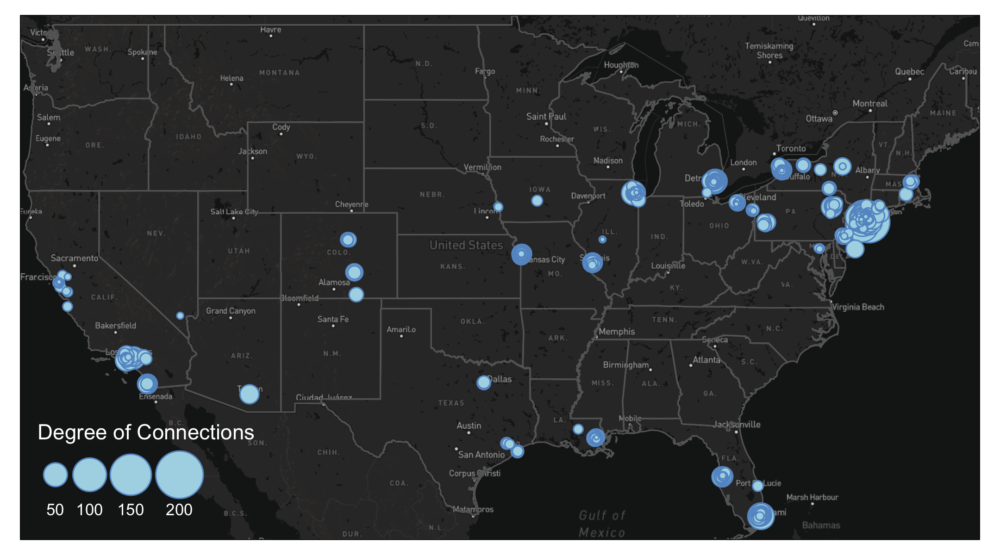
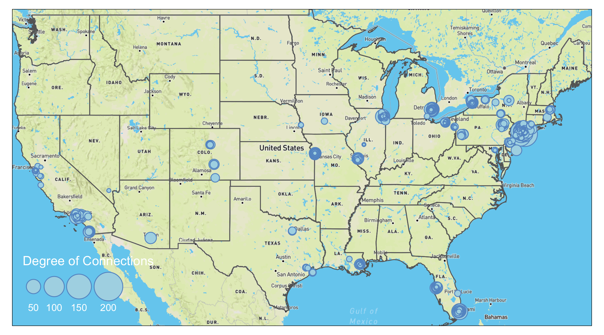

# Advanced Aesthetics 

You may need one or more of these libraries to complete the codes in this chapter. 
```{r, message=FALSE, warning=FALSE, eval=TRUE}
library(sf) #required for any functions start with`st_`
library(tidyverse) #required for any process that involves `%>%` 
library(tmap) #required for any map visualization 
library(SSNtools) #required for any steps that involved MafiaNodes or MafiaEdges dataset 
library(igraph) #required for creating network from graph_from_data_frame and calculating network metrics 
library(OpenStreetMap) #required for loading base map 
library(stars) #required for loading base map
library(tigris) #required for downloading boundary shapefiles 
library(grid) #required for inset
library(edgebundle) #required for edge bundling
```

## Export for Editing

`tmap` allows users to export `tmap object` as a static map in the format of pdf, eps, svg, wmf, png, jpg, bmp, or tiff. You can define the resolution, height, and width of the export in the `tmap_save` arguments. 

```{r, message=FALSE, eval=FALSE}
tmap_save(tm = TMAP_OBJECT, filename='PATH/FILENAME.png')
```

With these formats, you can import the tmap maps into Adobe Illustrators or Photoshop to further edit the details. You can also export the shapefiles you created in R to experiment in GIS softwares through `sf` package. 

```{r, message=FALSE, eval=FALSE}
#MafiaNodes is built-in dataset from SSNtools
MafiaSpatial = MafiaNodes %>% 
  st_as_sf(coords=c("LonX", "LatY"), crs = 4326) 

st_write(MafiaSpatial, "MafiaSpatial.shp") 
```

Unfortunately, there isn't a way to export tmap object to GIS softwares without losing the aesthetics yet (e.g., scale, size, color etc., see updates on this issue  [here](https://github.com/r-tmap/tmap/issues/510)). 

## Small Multiples
In our case of the Mafia connectivity map, the power of the Mafia members can be represented by different network metrics. For example, **degree centrality** (i.e. degree connections) measures power as the number of connections to a Mafia member. **Eigenvector centrality** (i.e., PageRank centrality) measures power by not only the count of connections, but also the quality of connections so that connecting to other powerful members increases the weight of the link. **Betweeness centrality** measures power by the ability of a Mafia member to be the "middle-man/middle-woman" and connect groups of other members that would not be connected otherwise. (Local) **Clustering coefficient** measures whether a Mafia member's friends tend to connect with each others (i.e., whether your friends are also your friends' friends). 

Noted that **closeness centrality** is also a common measure of power, but the metric is not well-defined for disconnected graphs. In our dataset, there exists small Mafia cliques that do not interact with others. Thus, we did not use this metric. To contrast these different notions of power in the Mafia map, small multiple comes in handy. 

Small multiple is a group of charts or graphs that use the same scale or axes for easy comparison. Here we show how to create a small multiple of the Mafia member map with various network metrics through tmap `tm_facets`.

Before we map the small multiple, there are some pre-processing. Firstly, when we add network metrics into the `MafiaSpatial`, each metric is in one column. However, the `tm_facet` only create multiples based on a column of value. Thus, we need to convert `MafiaSpatial` into a long table using `gather` function in `tidyverse` package (more accuratly, the `tidyr` package in `tidyverse`) so that column `metric` stores the type of metrics (e.g., "degree", "eigen", "betweenness", "cluster"), and the column `value` stores the metric value. 

Secondly, we convert the `metric` column into a factor column, so that the order of the variable to be mapped is specified. Otherwise, the order of mapping for the small multiple will follow the alphebatical order of the value string in the metric column. 

Lastly, we also retrieve the state boundary shapefile from `tigris` as the background for the map.

```{r, message=FALSE, warning=FALSE, eval=TRUE}
##### ---- Don't forget to load libraries at the top of the chapter ---- ####

#MafiaNodes and MafiaEdges are built-in dataset from SSNtools 
MafiaSpatial = MafiaNodes %>% 
  st_as_sf(coords=c("LonX", "LatY"), crs = 4326)

g = graph_from_data_frame(MafiaEdges, directed = FALSE, vertices=MafiaSpatial)

#Calculate network metrics
MafiaSpatial$degree = degree(g)
MafiaSpatial$eigen = eigen_centrality(g)$vector
MafiaSpatial$betweenness = betweenness(g, v=V(g))
MafiaSpatial$cluster = transitivity(g, type='local')

MafiaSpatial = MafiaSpatial %>% 
  gather(key='metric', value='value', degree:cluster) %>% 
  mutate(metric = factor(metric, levels=c('degree', 'eigen', 'betweenness', 'cluster')))

#states is a function from tigris package
us_states = states(cb=TRUE, progress_bar = FALSE) %>%
  filter(!STUSPS %in% c('PR','AS', 'AK', 'GU','MP','VI', 'HI'))
```

Now we can map the small multiple! We specify the column `metric` in the `by` argument in `tm_facets`, which stores variables that the split will use. `free.scales=T` enables each facet (subplot) creates its own legend with its own scale. `free.coords = F` enables each map to have its own coordinate range, which is necessary if you have a multi-layer small multiple. You can specify the style of each facet in `tm_layout` with `panel` related arguments. In our example, we specify the name for each facet. 

```{r, message=FALSE, warning=FALSE, eval=TRUE}
tm_shape(us_states) +  
  tm_polygons(alpha=0) + 
  tm_shape(MafiaSpatial) +
  tm_facets(by='metric', free.coords=F, free.scales = T) + 
  tm_symbols(size="value", scale=1, 
             col='lightblue', border.col='#6698CC', 
             title.size=c('Measure of Power')) +
  tm_layout(panel.labels = c('Degree Centrality', 'Eigenvector Centrality',
                             'Betweenness Centrality', 'Clustering Coefficient'))
```

From the maps above we can see that the most powerful mafia members are located around the New York City region. They are relatively more "powerful" in eigenvector centrality and betweenness centrality measures, and less so in degree centrality and clustering coefficients. Despite the concentration of power is in the Northeast, local mafia members can still be powerful as being well-embedded in a local social network. Many of the mafia families in the isolated regions (e.g., Colorado, Midwest, Texas) are very closely connected with each other. 

If you found the different value range across the metrics confusing or misleading (some metrics tend to follow power law), you can also standardize the metric values into respective percentile by adding the following lines before the `gather`. For example, a metric with value `c(4, 1, 2, 3, 5)` will be converted to `c(0.75, 0, 0.25, 0.5, 1)`.

```{r, message=FALSE, warning=FALSE, eval=TRUE}
MafiaSpatial = MafiaNodes %>% 
  st_as_sf(coords=c("LonX", "LatY"), crs = 4326)

g = graph_from_data_frame(MafiaEdges, directed = FALSE, vertices=MafiaSpatial)

#Convert the metrics to percentile 
MafiaSpatial$degree = rank(degree(g))/length(degree(g))
MafiaSpatial$eigen = rank(eigen_centrality(g)$vector)/length(eigen_centrality(g)$vector)
MafiaSpatial$betweenness = rank(betweenness(g, v=V(g)))/length(betweenness(g, v=V(g)))
MafiaSpatial$cluster = rank(transitivity(g, type='local'))/length(transitivity(g, type='local'))

#same as above 
MafiaSpatial = MafiaSpatial %>% 
  gather(key='metric', value='value', degree:cluster) %>% 
  mutate(metric = factor(metric, levels=c('degree', 'eigen', 'betweenness', 'cluster'))) 

tm_shape(us_states) +  
  tm_polygons(alpha=0) + 
  tm_shape(MafiaSpatial) +
  tm_facets(by='metric', free.coords=F, free.scales = T) + 
  tm_symbols(size="value", scale=1, 
             col='lightblue', border.col='#6698CC', 
             title.size=c('Measure of Power')) +
  tm_layout(panel.labels = c('Degree Centrality', 'Eigenvector Centrality',
                             'Betweenness Centrality', 'Clustering Coefficient'))
```

## Interactive Maps

`tmap` allows users to view their maps in interactive modes with pre-defined Leaflet basemap styles, such as OpenStreetMap, Esri.WorldGrayCanvas, and Esri.WorldTopoMap. This is a quick and easy way to generate preliminary maps with base maps for presentations and illustrations. The interactive mode can also help you examine your data in a spatial context by adding pop up labels or hover labels.

You can also publish your `tmap` interactive map to web through RPub under your account. As an example, copy and paste the following code in a `Rmd` file. You can create `Rmd` file from Rstudio File->New File->R Markdown. In R Markdown, `Knit` the file and the option to `Publish` should appear. You can select the RPub option and create a free account. See [this post](https://nceas.github.io/oss-lessons/publishing-maps-to-the-web-in-r/publishing-maps-to-the-web-in-r.html) for more details. At the moment, the interactive map from `tmap` did not have the function to adapt the node size with the zoom level. This function exists in `Leaflet` package with `addCircleMarkers()` function (more details see this [tutorial](https://rstudio.github.io/leaflet/markers.html))

```{r warning=FALSE, message=FALSE, echo=TRUE, eval=FALSE}
#### ---- Uncomment the commented lines below in R markdown ----- #### 

#---
#output: html_document
#---

#```{r warning=FALSE, message=FALSE, echo=TRUE, eval=FALSE}

library(tidyverse)
library(sf)
library(tmap)
library(SSNtools)
library(igraph)

MafiaSpatial = MafiaNodes %>% 
  st_as_sf(coords=c("LonX", "LatY"), crs = 4326) 
g = graph_from_data_frame(MafiaEdges, directed = FALSE, vertices=MafiaSpatial)
MafiaSpatial$degree = degree(g)

#set tmap_mode to 'view' will enable interactive mode in Rstudio Plots window
tmap_mode('view')
tm_shape(MafiaSpatial) +
  tm_symbols(size="degree", scale=5, 
             col='lightblue', border.col='#6698CC', 
             title.size=c('Degree of Connections'), 
             #determine the hover label
             id = 'NiceLabel',  
             #determine the pop up contents
             popup.vars = c('Name: '='NiceLabel', 'Mafia Family: '='Family', 
                            'Degree of Connections: '='degree')) +
  #add a function where you can see coordinates on mouseover
  tm_mouse_coordinates()

#```
```

This is an [example publish](https://rpubs.com/xiaofanliang/831192) to RPub and what the output will look like. Click and hover your mouse in the map to explore the pop up labels and see the changing coordinates on the top left corner. You can also switch the base map style in the box below the zoom functions. 
```{r, echo=FALSE}
htmltools::includeHTML("interactive_tmap_to_web.html")
```

## Base Map 

While interactive map comes with base maps, you can manually add base map into static maps in `tmap`. This section shows you how to add **Mapbox base map** to `tmap` map in the plot mode. To use Mapbox base map, you need to create a token on Mapbox. Follow the instructions on [Mapbox Docs](https://docs.mapbox.com/help/getting-started/access-tokens/) to create your access token. You should keep this token private. 

We use `st_bbox` to find the bounding box of U.S. states and use the `get_Mapbox` function to retrieve Mapbox base map based on the input bounding box information. This base map raster can be visualized by `tmap` through `tm_rgb()`. 

```{r, warning=FALSE, message=FALSE, eval=FALSE}
library(tigris)
library(OpenStreetMap)
library(stars)
library(sf)
library(tidyverse)

#bb: bounding box in st_bbox format. 
#token: your Mapbox token 
#style: Mapbox base map style. You can also insert customized style from Mapbox. 

token = 'YOUR MAPBOX TOKEN'

get_Mapbox = function(bb, token, style) {
  apiKey <- paste0("?access_token=", token)
  baseUrl <- paste0("https://api.mapbox.com/styles/v1/mapbox/", style,
                    "/tiles/256/{z}/{x}/{y}")
  #coordinate for upper left
  ul  <- c(attributes(bb)$bbox$ymax,attributes(bb)$bbox$xmin) 
  #coordinate for lower right 
  lr <- c(attributes(bb)$bbox$ymin,attributes(bb)$bbox$xmax) 
  map <- openmap(ul,lr, minNumTiles=10, type=paste0(baseUrl,apiKey))
  #process map into stars to be mapped in tmap 
  map = st_as_stars(map)
  return(map)
}

#states is a function in tigris to download U.S. state boundary shapefile
us_states = states(cb=TRUE, progress_bar = FALSE) %>%
  filter(!STUSPS %in% c('PR','AS', 'AK', 'GU','MP','VI', 'HI')) 

box = st_bbox(us_states, crs=4326) 
bg = get_Mapbox(box %>% st_as_sfc(), token, 'light-v10')

tmap_mode('plot')
map = tm_shape(bg) + 
  tm_rgb() + 
  tm_shape(us_states) + 
  tm_polygons(alpha=0) + 
  tm_shape(MafiaSpatial) +
  tm_symbols(size="degree", scale=5, 
             col='lightblue', border.col='#6698CC', 
             title.size=c('Degree of Connections')) + 
  tm_layout(legend.position = c('left', 'bottom'))

map
```

You can find all the available Mapbox style [here](https://docs.mapbox.com/api/maps/styles/). You can also customize your Mapbox basemap in [Mapbox Studio](https://studio.mapbox.com/). To use the customized base map, replace the baseUrl in the function with your customized style URL (only replace path after https://api.mapbox.com/styles/), which you can find if you click "share" button for your customized style. This shows the output of the code above with Mapbox style: `light-v10` (top left), `dark-v10` (top right), `outdoors-v11` (bottom left), `satellite-v9` (bottom right).   

```{r echo=FALSE, fig.cap="", out.width = '50%', fig.show = "hold"}
knitr::include_graphics("Figs/05-aesthetics-1.png")


knitr::include_graphics("Figs/05-aesthetics-4.png")
```

Sometimes you may want a customized bounding box that is not based on data layer. A helpful tool to find the coordinates around your data is to visualize your data in the interactive mode with `tm_mouse_coordinates()` (see example above). You can also specify the bounding box of your base map using the following code: 

```{r, warning=FALSE, message=FALSE, eval=FALSE}
#remember to add crs argument for specialized coordinates
box = st_bbox(c(xmin=-77.25586, xmax=41.82353, ymin=-71.10352, ymax=38.94553), crs=4326) %>% st_as_sfc()
```

## Inset Map

From the current mafia member map we can see that a lot of the mafia members cluster around the New York City region. We are not able to see the details in that areas due to cluttered nodes. This is a common problem at mapping spatial social networks when you have a both regional and local social connections. 

To decide on the Inset Map bounding box, you can either use the measurement from other shapefiles (e.g., NYC five boroughs) or use `tm_mouse_coordinates()` (see example in Interactive Map) to identify ideal bounding box. The example below uses information picked up by the `tm_mouse_coordinates()`.

First, we need to create the inset map. We pick a bounding box around the central New York City including where the most connected mafia member (in degree of connections) locates. We also calculate *aspect_ratio* for the inset map so that when plugged into the background map, we can preserve the inset map's natural ratio of height and width.  

```{r, warning=FALSE, message=FALSE, eval=FALSE}

#Create the bounding box for the inset map and retrieve corresponding base map 
bgbox = st_bbox(c(xmin=-74.065141, xmax=-73.537727, ymin=40.558198, ymax=40.882353), crs=4326) 
inset_bg = get_Mapbox(bgbox %>% st_as_sfc(), token, 'light-v10')

#Calculate aspect ratio.  
aspect_ratio = unname((bgbox$ymax - bgbox$ymin)/(bgbox$xmax - bgbox$xmin))

#putting base map as the first layer restricts the bounding box of the map, so no additional filtering for MafiaSpatial is needed.
tmap_mode('plot')
inset = tm_shape(inset_bg) +
  tm_rgb() + 
  tm_shape(MafiaSpatial) + 
  tm_symbols(size="degree", scale=2, 
             col='lightblue', border.col='#6698CC', 
             title.size=c('Degree of Connections'),
             legend.size.show = FALSE) + 
  tm_layout(main.title='Inset of New York',
            main.title.fontface = 2,
            main.title.position = c('center', 'top'))
```

Then, we use `tmap_save` to export the background map `map` created in the [Base Map] section with the inset map. `viewport` function comes from the `grid` package and can be used to position the inset map on the background map. We set an arbitrary value for width and adjust the height according to the aspect ratio of the inset map to preserve its shape. You also can create multiple inset maps and pass to the `insets_tm` argument as a list (e.g., `insets_tm = list(inset1, inset2)`). Same for `insets_vp`. You can pass a list of viewport (e.g., `insets_vp = list(viewport(X), viewport(Y))`). 

```{r, warning=FALSE, message=FALSE, eval=FALSE}
#library(grid)
tmap_save(map, insets_tm=inset, 
          insets_vp = viewport(0.17, 0.75, width = 1, height = aspect_ratio*0.75),
          filename='PATH', dpi=600)
```

```{r echo=FALSE, fig.cap="", out.width = '100%', fig.show = "hold"}
knitr::include_graphics("Figs/05-aesthetics-inset.png")
```

We can also add a small black bounding box on the background map to indicate where the inset map locates. We also increase the line width of the frame of the inset map to visually match with the aesthetic of the bounding box. 

```{r, warning=FALSE, message=FALSE, eval=FALSE}
inset = inset + tm_layout(frame=TRUE, frame.lwd = 2)

map = map + tm_shape(st_bbox(inset_bg) %>% st_as_sfc()) + 
  tm_polygons(alpha=0, border.col = 'black', lwd=2)

tmap_save(map, insets_tm=inset, 
          insets_vp = viewport(0.17, 0.75, width = 1, height = aspect_ratio*0.75),
          filename='PATH', dpi=600)
```

```{r echo=FALSE, fig.cap="", out.width = '100%', fig.show = "hold"}
knitr::include_graphics("Figs/05-aesthetics-inset_w_box.png")
```

## Edge Bundling

Edge bundling is a technique to reduce visual cluttering of the edges. The algorithm behind edge bundling essentially **bundles** edges that go in the same direction and **split** them apart when they are close to their destinations. The algorithm of a complete edge bundling technique has three steps: first, it clusters edges based on their origin and destination; second, it calculates how to bend the geometry of a straight line given the user input of how "strong" you want the bundle to be. A stronger bundle means that you want more edges and edges far from the bundle to be bundled together; third, the algorithm may summarise the weights of the bundled edges so that the weight of the resultant bundle is larger (and thus visually thicker). You can implement edge bundling in [QGIS2](https://anitagraser.com/2017/10/08/movement-data-in-gis-8-edge-bundling-for-flow-maps/) or [D3](https://bl.ocks.org/sjengle/2e58e83685f6d854aa40c7bc546aeb24) or [Python](https://github.com/ait-energy/qgis-edge-bundling).

This technique may help reveal structures in your edges when there are many lines, especially if you believe your edges follow a hierarchical structure, yet **it is not a savior to your flow map**. You should use this technique with caution because it has the following drawbacks: 

* It takes a long time to do edge bundling. We recommend running our codes on a network with 1000-3000 edges to get quick feedback on the visual output. 
* It may bend the edges in unnatural ways.
* It may be difficult to tell exactly where the edge come from and go to after you bend the edges. 
* It may be difficult to visualize directionality in the flow map. 
* You have to manually tune the parameters (`thres` in our case) to find the best visual outcome. There is no shortcut to find the optimized parameters at once. 
* Some edge bundling package may only be able to bend the lines, but not summarise the edge weights. It means that it is difficult to visualize the edge weight of the bundle. 

The `edgebundle` package we used is still in development. We showed an example of applying the edgebundle package on the mafia map. To reduce the processing time, we filtered mafia connections to those that have more than 50km in euclidean distance, which results in 1668 edges. To filter by distance, we have to convert the coordinate system to **North America Equidistant Conic** (crs=102010), use `st_distance` to compute the distance between two point geometry, and lastly convert the `meter object` from `st_distance` into numeric numbers for filtering. This is a mafia connectivity map without the edge bundling. 

```{r, warning=FALSE, message=FALSE, eval=FALSE}
#MafiaEdges and MafiaNodes is a built-in dataset of SSNtools package 

MafiaSpatial = MafiaNodes %>% 
  st_as_sf(coords=c("LonX", "LatY"), crs = 4326)

#Filter MafiaEdges to edges that have more than 50km. 
FilteredEdges = MafiaEdges %>% 
  left_join(MafiaSpatial %>% select(c(NODE, geometry)) %>% st_transform(crs=102010), by = c('Source' = 'NODE')) %>%
  left_join(MafiaSpatial %>% select(c(NODE, geometry)) %>% st_transform(crs=102010), by = c('Target' = 'NODE')) %>%
  mutate(distance = st_distance(geometry.x, geometry.y, by_element=TRUE)) %>% 
  select(-c(geometry.x, geometry.y)) %>%
  mutate(distance = as.numeric(distance)) %>% 
  filter(distance > 50000)

g = graph_from_data_frame(MafiaEdges, directed = FALSE)
MafiaSpatial$degree = degree(g)

#Convert FilteredEdges dataframe to line geometry. 
EdgeSpatial = FilteredEdges %>% 
  left_join(MafiaSpatial %>% select(c(NODE, geometry)), by = c('Source' = 'NODE')) %>%
  left_join(MafiaSpatial %>% select(c(NODE, geometry)), by = c('Target' = 'NODE')) %>%
  mutate(geometry = st_cast(st_union(geometry.x, geometry.y), "LINESTRING")) %>% 
  select(-c(geometry.x, geometry.y)) %>% st_as_sf()

tmap_mode('plot')
map = tm_shape(bg) + 
  tm_rgb() + 
  tm_shape(us_states) + 
  tm_polygons(alpha=0) + 
  tm_shape(EdgeSpatial) + 
  tm_lines(lwd=0.5, alpha=0.3, col='#1B665D') + 
  tm_shape(MafiaSpatial) +
  tm_symbols(size="degree", scale=2, 
             col='lightblue', border.col='#6698CC', 
             title.size=c('Degree of Connections')) + 
  tm_layout(legend.position = c('left', 'bottom'))

map
```
```{r echo=FALSE, fig.cap="", out.width = '100%', fig.show = "hold"}
knitr::include_graphics("Figs/05-aesthetics-beforeBundle.png")
```

The map shows clearly that many of the connections are going to New York City. There are also a lot of connections that go stragith from west coast to east coast. Let's try edge bundling and see if it makes the map better. 

The `edge_bundle_force` function from the `edgebundle` pacakage takes into three arguments: 1) `g` which is the network constructed through `igraph`, 2) `xy` which is the longitude and latitude of all the nodes in the network, and 3) `compatibility_threshold` which indicates the strength of the bundling. A higher value means that the bending and the bundling will be less intense. This package **can only bend the edges into bundles** but not beyond that.  

The result of the `edge_bundle_force` returns four columns. `x` and `y` are the coordinates of the points that consist of a bundled edge. `group` indicates that coordinates in the same group are for one bundled edge and `index` indicates the order of points for that particular bundled edge. We can see that for group 1, the fbundle result starts with the first name in the `Source` of `FilteredEdges`, BLANDA-CHARLES (-104.6270, 38.2476), and after 34 points, it will end with the `Target`, SMALDONE-EUGENE (-104.9479, 39.7681). 

```{r, warning=FALSE, message=FALSE, eval=FALSE}
library(edgebundle)
#FilteredEdges %>% slice(1:3)
#               Source             Target   distance
# 1     BLANDA-CHARLES    SMALDONE-EUGENE   97252.56
# 2     DIVARCO-JOSEPH        SICA-JOSEPH 6054967.18
# 3 DEMARTINO-BENJAMIN DEMARTINO-THEODORE  182989.39

#The current EdgeSpatial is line geometry 
bundle_g = graph_from_data_frame(FilteredEdges, directed=FALSE)
node = data.frame(id = V(bundle_g)$name) %>% mutate(id = as.character(id))
#>                   id
#> 1     BLANDA-CHARLES
#> 2     DIVARCO-JOSEPH
#> 3 DEMARTINO-BENJAMIN

node = node %>% 
  left_join(MafiaNodes %>% select(c(NODE, LonX, LatY)), by=c('id' = 'NODE'), copy=FALSE)

#>                   id      LonX    LatY
#> 1     BLANDA-CHARLES -104.6270 38.2476
#> 2     DIVARCO-JOSEPH  -87.7354 42.0154
#> 3 DEMARTINO-BENJAMIN  -72.9263 40.9530

xy = cbind(node$LonX, node$LatY)
fbundle = edge_bundle_force(g,xy,compatibility_threshold = 0.85)

#>           x        y      index group
#> 1 -104.6270 38.24760 0.00000000     1
#> 2 -104.6506 38.30726 0.03030303     1
#> 3 -104.6641 38.33735 0.06060606     1
```

Thus, to create lines acceptable to `tmap` from the fbundle result, we need to convert coordinates to points, group by the `group` column, and summarise the points into lines. It is important that `do_union=FALSE` argument is set in the `summarise()` to preserve the order of points (otherwise summarise will rearrange the point order). 

```{r, warning=FALSE, message=FALSE, eval=FALSE}
fbundle2 = fbundle %>%
  st_as_sf(coords=c('x', 'y'), crs=4326) %>%
  group_by(group) %>%
  summarise(do_union=FALSE) %>% st_cast("LINESTRING")
```

Now the `fbundle2` is a line shapefile! We can either export to GIS for further editing or map it using `tmap` package. See [Base Map] on how to create `bg` background base map and `us_states` boundary shapefiles. 

```{r, warning=FALSE, message=FALSE, eval=FALSE}
tmap_mode('plot')
tm_shape(bg) + 
  tm_rgb() + 
  tm_shape(us_states) + 
  tm_polygons(alpha=0) + 
  tm_shape(fbundle2) + 
  tm_lines(lwd=0.5, alpha=0.3, col='#1B665D') + 
  tm_shape(MafiaSpatial %>% arrange(desc(degree))) +
  tm_symbols(size="degree", scale=2, 
             col='lightblue', border.col='#6698CC', 
             title.size=c('Degree of Connections')) + 
  tm_layout(legend.position = c('left', 'bottom'))
```
```{r echo=FALSE, fig.cap="", out.width = '100%', fig.show = "hold"}
knitr::include_graphics("Figs/05-aesthetics-afterBundle.png")
```
The bundling effect is most obvious when you contrast lines going from Florida to New York. Several edges have been bundled together. However, you can also see some unnatural bends from lines going from Florida to New York City. That is because the lines were bended halfway. In our case of the mafia map, we are not sure the edge bundling improves the visual. Again, edge bundling should be applied with cautions and experiments. 