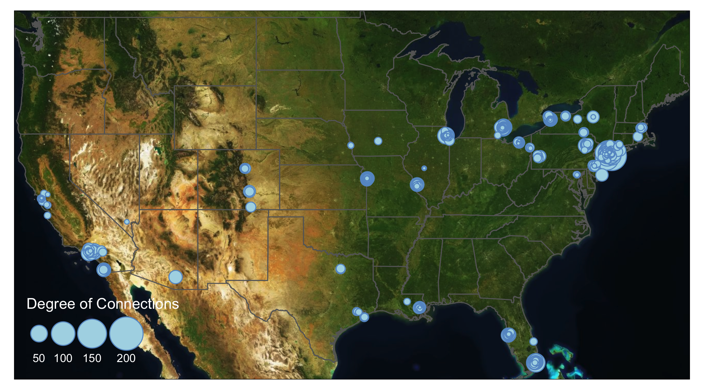

# Advanced Aesthetics 

## Export for Editing

`tmap` allows users to export `tmap object` as a static map in the format of pdf, eps, svg, wmf, png, jpg, bmp, or tiff. You can define the resolution, height, and width of the export. 

```{r, message=FALSE, eval=FALSE}
tmap_save(tm = TMAP_OBJECT, filename='PATH/FILENAME.png')
```

With these formats, you can import the tmap maps into Adobe Illustrators or Photoshop to further edit the details. You can also export the shapefiles you created in R to experiment in GIS softwares through `sf` package. 

```{r, message=FALSE, eval=FALSE}
library(sf)
library(tidyverse)
library(tmap)
library(SSNtools)

MafiaSpatial = MafiaNodes %>% 
  st_as_sf(coords=c("LonX", "LatY"), crs = 4326) 

st_write(MafiaSpatial, "MafiaSpatial.shp") 
```

Unfortunately, there isn't a way to export tmap object to GIS softwares without losing the aesthetics yet (e.g., scale, size, color etc., see updates on this issue  [here](https://github.com/r-tmap/tmap/issues/510)). 

## Small Multiples


## Interactive Maps

`tmap` allows users to view their maps in interactive modes with pre-defined Leaflet basemap styles, such as OpenStreetMap, Esri.WorldGrayCanvas, and Esri.WorldTopoMap. This is a quick and easy way to generate preliminary maps with base maps for presentations and illustrations. The interactive mode can also help you examine your data in a spatial context by adding pop up labels or hover labels.

You can also publish your `tmap` interactive map to web through RPub under your account. As an example, copy and paste the following code in a `Rmd` file. You can create `Rmd` file from Rstudio File->New File->R Markdown. In R Markdown, `Knit` the file and the option to `Publish` should appear. You can select the RPub option and create a free account. See [this post](https://nceas.github.io/oss-lessons/publishing-maps-to-the-web-in-r/publishing-maps-to-the-web-in-r.html) for more details. At the moment, the interactive map from `tmap` did not have the function to adapt the node size with the zoom level. This function exists in `Leaflet` package with `addCircleMarkers()` function (more details see this [tutorial](https://rstudio.github.io/leaflet/markers.html))

```{r warning=FALSE, message=FALSE, echo=FALSE, eval=FALSE}
#### Uncomment the commented lines below in R markdown #### 

#---
#output: html_document
#---

#```{r warning=FALSE, message=FALSE, echo=TRUE, eval=FALSE}

library(tidyverse)
library(sf)
library(tmap)
library(SSNtools)
library(igraph)

MafiaSpatial = MafiaNodes %>% 
  st_as_sf(coords=c("LonX", "LatY"), crs = 4326) 
g = graph_from_data_frame(MafiaEdges, directed = FALSE, vertices=MafiaSpatial)
MafiaSpatial$degree = degree(g)

tmap_mode('view')
tm_shape(MafiaSpatial) +
  tm_symbols(size="degree", scale=5, 
             col='lightblue', border.col='#6698CC', 
             title.size=c('Degree of Connections'), 
             #determine the hover label
             id = 'NiceLabel',  
             #determine the pop up contents
             popup.vars = c('Name: '='NiceLabel', 'Mafia Family: '='Family', 
                            'Degree of Connections: '='degree')) +
  #add a function where you can see coordinates on mouseover
  tm_mouse_coordinates()

#```
```

This is an [example publish](https://rpubs.com/xiaofanliang/831192) to RPub and what the output will look like. Click and hover your mouse in the map to explore the pop up labels and see the changing coordinates on the top left corner. You can also switch the base map style in the box below the zoom functions. 
```{r, echo=FALSE}
htmltools::includeHTML("interactive_tmap_to_web.html")
```

## Base Map 

While interactive map comes with base maps, you can manually add base map into static maps in `tmap`. This section shows you how to add **Mapbox base map** to `tmap` map in the plot mode. To use Mapbox base map, you need to create a token on Mapbox. Follow the instructions on [Mapbox Docs](https://docs.mapbox.com/help/getting-started/access-tokens/) to create your access token. You should keep this token private. 

We use `st_bbox` to find the bounding box of U.S. states and use the `get_Mapbox` function to retrieve Mapbox base map based on the input bounding box information. This base map raster can be visualized by `tmap` through `tm_rgb()`. 

```{r, warning=FALSE, message=FALSE, eval=FALSE}
library(tigris)
library(OpenStreetMap)
library(stars)
library(sf)
library(tidyverse)

#bb: bounding box in st_bbox format. 
#token: your Mapbox token 
#style: Mapbox base map style. You can also insert customized style from Mapbox. 

token = 'YOUR MAPBOX TOKEN'

get_Mapbox = function(bb, token, style) {
  apiKey <- paste0("?access_token=", token)
  baseUrl <- paste0("https://api.mapbox.com/styles/v1/mapbox/", style,
                    "/tiles/256/{z}/{x}/{y}")
  #coordinate for upper left
  ul  <- c(attributes(bb)$bbox$ymax,attributes(bb)$bbox$xmin) 
  #coordinate for lower right 
  lr <- c(attributes(bb)$bbox$ymin,attributes(bb)$bbox$xmax) 
  map <- openmap(ul,lr, minNumTiles=10, type=paste0(baseUrl,apiKey))
  #process map into stars to be mapped in tmap 
  map = st_as_stars(map)
  return(map)
}

#states is a function in tigris to download U.S. state boundary shapefile
us_states = states(cb=TRUE, progress_bar = FALSE) %>%
  filter(!STUSPS %in% c('PR','AS', 'AK', 'GU','MP','VI', 'HI')) 

box = st_bbox(us_states, crs=4326)
bg = get_Mapbox(box, token, 'light-v10')

tmap_mode('plot')
map = tm_shape(bg) + 
  tm_rgb() + 
  tm_shape(us_states) + 
  tm_polygons(alpha=0) + 
  tm_shape(MafiaSpatial) +
  tm_symbols(size="degree", scale=5, 
             col='lightblue', border.col='#6698CC', 
             title.size=c('Degree of Connections'))

map
```

You can find all the available Mapbox style [here](https://docs.mapbox.com/api/maps/styles/). You can also customize your Mapbox basemap in [Mapbox Studio](https://studio.mapbox.com/). To use the customized base map, replace the baseUrl in the function with your customized style URL (only replace path after https://api.mapbox.com/styles/), which you can find if you click "share" button for your customized style. This shows the output of the code above with Mapbox style: `light-v10` (top left), `dark-v10` (top right), `outdoors-v11` (bottom left), `satellite-v9` (bottom right).   

```{r echo=FALSE, fig.cap="", out.width = '50%', fig.show = "hold"}
knitr::include_graphics("Figs/05-aesthetics-1.png")
knitr::include_graphics("Figs/05-aesthetics-2.png")
knitr::include_graphics("Figs/05-aesthetics-3.png")

```

Sometimes you may want a customized bounding box that is not based on data layer. A helpful tool to find the coordinates around your data is to visualize your data in the interactive mode with `tm_mouse_coordinates()` (see example above). You can also specific the bounding box of your base map using the following code: 

```{r, warning=FALSE, message=FALSE, eval=FALSE}
#from left to right, the order of coordinate input should be xmin, ymax, xmax, ymin
box = st_bbox(c(-77.25586, 41.82353, -71.10352, 3894553)) %>% st_as_sfc()
```

## Inset Map

From the current mafia member map we can see that a lot of the mafia members cluster around the New York City region. We are not able to see the details in that areas due to cluttered nodes. This is a common problem at mapping spatial social networks when you have a both regional and local social connections. 

```{r, warning=FALSE, message=FALSE, eval=FALSE}

```

## Edge Arc 

## Edge Bundling