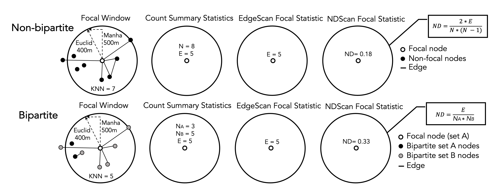
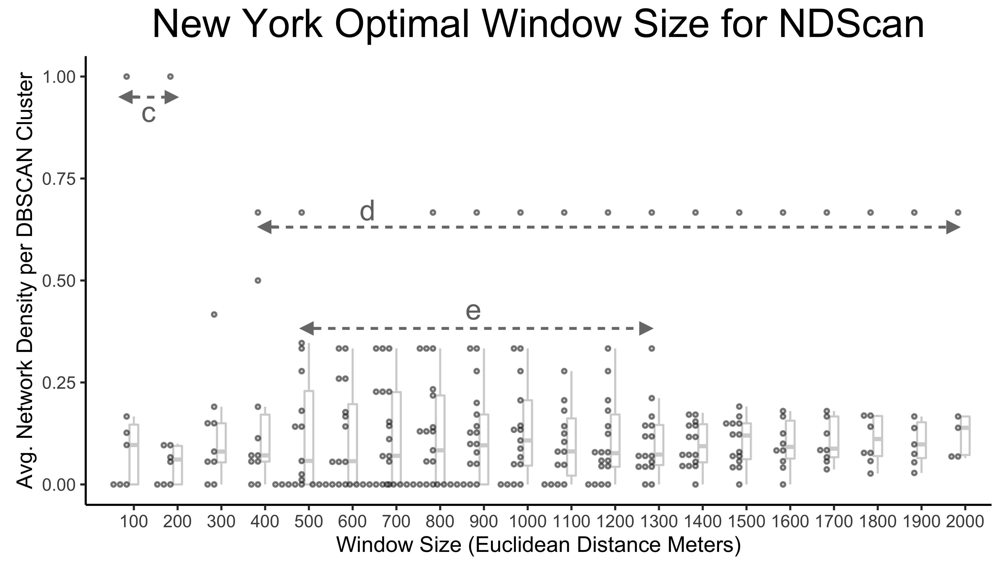
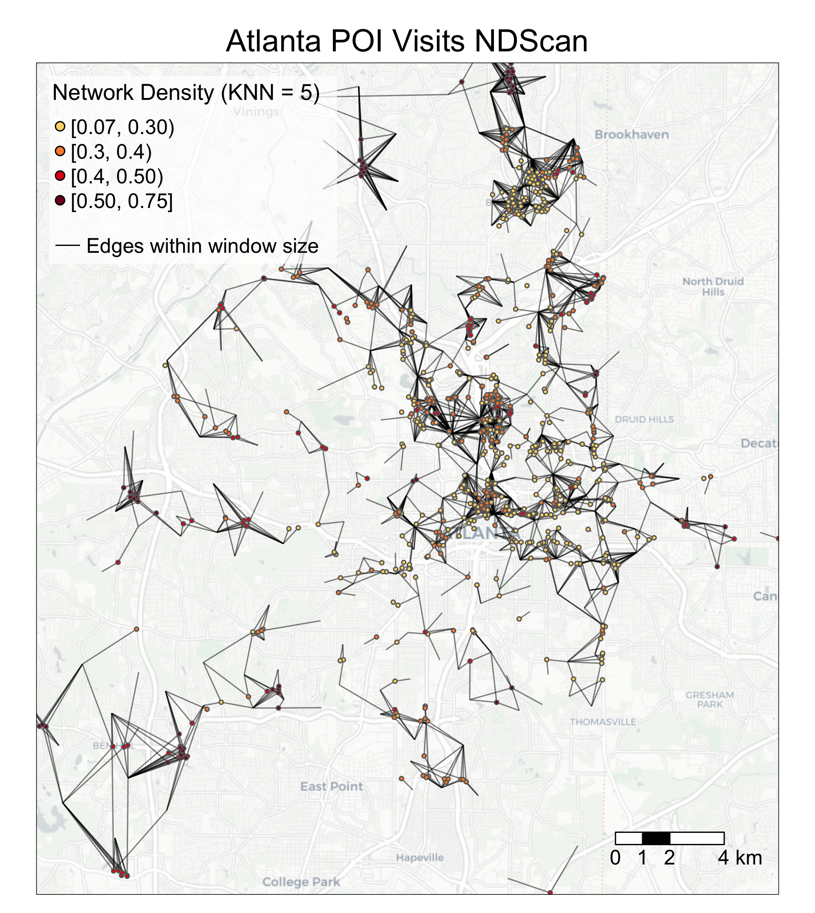
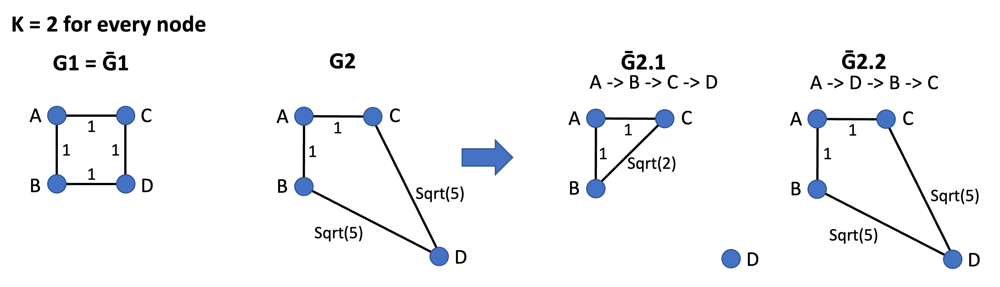

# Advanced SSN Metrics 

The following subchapters will introduce advanced SSN metrics. **Spatial Social Network (SSN)** refers to social networks where the nodes are also geolocated. They can be collaborations between organizations, economic hiring between individuals, trades between companies, and friendships. Different from social network metrics or spatial methods, these metrics tend to focus on the interaction between the networks and geographic space. While the metrics are designed for small-scale SSNs, some can also be applied to analyze origin-destination flows, POI visits, and mobility data. 

You can download the R codes for the following subchapters from GitHub here (go to : 
* 

## SSN Hotspots Detection

In this chapter we show two GIS methods, **EdgeScan** and **NDScan**, for capturing areas with high and low levels of number of edges or network density respectively. Both methods are moving window processes that count the number of edges and network density, respectively, for each node in a given focal area (window area). It is important to note that while our functions report **EdgeScan** and **NDScan** values on the node level, **these values represent local social connections in the moving window area centered by that node**. Thus, it is possible that a node can have high **EdgeScan** and **NDScan** values, but are not connected with others locally. The contents below come from this paper published in *Transactions in GIS*: [Is Your Neighbor Your Friend? Scan Methods for Spatial Social Network (SSN) Hotspot Detection (Liang et al., 2023)](https://onlinelibrary.wiley.com/doi/10.1111/tgis.13050). 

Here are some example research questions that will benefit from **EdgeScan** and **NDScan** metrics: 

* (Mafia members SSN) Where do mafia members both cluster in geographic proximity and connect in network space? 
* (Restaurant POI visits SSN) Where do restaurants cluster and serve local clientele (i.e., heavy-weighted connections to nearby census block groups)? 
* (Food sharing SSN) Where are organizations that locate close-by but do not collaborate or share resources with each other? 

Our tutorial will cover the following topics:

* How to calculate SSN hotspots using `edgeScanRadius()`, `edgeScanManhattan()`, `edgeScanKNearest()`, `NDScanRadius()`, `NDScanManhattan`, and `NDScanKNearest()` in `SSNtools`.
* How to visualize SSN hotspots
* (Advanced) How to find optimal window sizes for SSN hotspots
* (Advanced) How to calculate SSN hotspots within a walking distance radius, using `NDScanMatrix()` and `edgeScanMatrix()` in `SSNtools`, with OSM (OpenStreetMap) data as an input matrix. 
* (Advanced) Application to a weighted and bipartite network (POI visits) 

To begin, let us introduce the basic ideas behind the **EdgeScan** and **NDScan** methods. Both methods are based on spatial scan approaches, which summarised statistics in a moving window for a focal node. Therefore, for each node in the network, EdgeScan and NDScan calculate **the number of edges** and **network density** in the area centered by the focal node. Network density is the ratio of actual number of edges and the potential number of edges. A high network density (=1) means that nodes in the moving window have maximize all the possible combinations of connections. 

Our EdgeScan and NDScan methods provide four different **neighborhood definitions**: 

* Euclidean distance
* Manhattan distance
* User-defined distance (e.g., walking distance)
* K-nearest neighbors

The users can input the following **window size** 

* distance in the unit of coordinate systems (meter in our example)
* a user-defined distance matrix
* the number of nearest neighbors. 

The graphic below shows a schematic diagram of how the EdgeScan and NDScan value for a focal node is calculated. The window in the first circle simultaneously represents a potential window size of Euclidean distance of 400m, Manhattan distance of 500m, and 7-nearest neighbors. 

```{r echo=FALSE, fig.cap="Schematic Diagram of EdgeScan and NDScan Values Calculation", out.width = '100%', fig.show = "hold"}

```

We will continue to use sample datasets **NYCMafiaNodes**, **NYCMafiaEdges**, **POINodes**, and **POIEdges** and in `SSNtools` to illustrate examples. To load the sample datasets and the functions, go to GitHub [SSNtool](https://github.com/friendlycities-gatech/SSNtools) to download the development R package, or type the following lines in your R console. Click the GitHub page for more detailed description of all the functions available in the package and the input formats for each function.

```{r warning=FALSE, message=FALSE, eval=FALSE}
# install.packages("devtools")
devtools::install_github("friendlycities-gatech/SSNtools")
```

**NYCMafiaNodes** is a node table with label and spatial coordinates for each node (a mafia member). **NYCMafiaeEdges** contains pairs of node labels (corresponding to node table label), representing mafia criminal associations. This is a unweighted and undirected network. The coordinate system crs is 32118, in the unit of meters. Data in **POINodes** and **POIEdges** are processed from SafeGraph with extra filters and coding to hide sensitive information. The dataset is meant to be educational and thus can be inaccurate for real implications. The nodes in the dataset are restaurants in Atlanta (set 0) and centroids of census block group (set 1). The edges in the dataset are visits from the census block group to restaurants. The weight of the edges represent the percentage of total visits coming from a particular census block group. You can call **POINodes** (n=1356) and **POIEdges** (n=7926) to directly access the sample dataset. The coordinates system is transformed with crs=26967 (unit meter). 

Functions in `SSNtools` run on base R syntax, though wrangling data may require additional package dependencies. Based on the definitions of EdgeScan and NDScan, `directed` argument is only implemented for ND-functions, while `weighted` argument is only implemented for the Edge-functions.

### Calculate SSN hotspots using radius or K-nearest neighbor window sizes

To get EdgeScan and NDScan value for each node, you just need to run your node and edge tables through the following codes: 

```{r, message=FALSE, warning=FALSE, eval=TRUE}
library(SSNtools)

data(NYCMafiaNodes)
data(NYCMafiaEdges)

# ----process dataframe into a list of lists 
# params:
#     data - a R dataframe containing node label, longitude, and latitude
#     label_name - the name of the column for node label
#     lon_name - the name of the column for node longitude 
#     lat_name - the name of the column for node latitude
#     bipartite_name - (optional) the name of the column that indicates the bipartite set of the nodes. The set of nodes that EdgeScan or NDScan should report on should be coded as 1 in the biparite column, and 0 otherwise.  
nodes = processNode(NYCMafiaNodes, 'label', 'LonX', 'LatY')
# params:
#     data - a R dataframe containing source node label and target node label
#     source_name - the name of the column for source node label
#     target_name - the name of the column for target node label
#     weight_name - (optional) the name of the column for edge weight 
edges = processEdge(NYCMafiaEdges, 'Source', 'Target')

#----calculate the density of edges within a radius (500 meters - Euclidean distance) of every node in a graph
# params:
#     nodes - a list of named lists. Each sublist contains a node.
#     edges - a list of list. Each sublist contains an edge.
#     radius - radius (in the coordinate unit) of the scanning window. 
#     (optional) min - minimum number of points required to be in the search window. Default to 3.
#     (optional) weighted - whether the result, number of edges, will be weighted (as sum of edge weights). Default to FALSE.
#     (optional) bipartite - whether the result will be calculated as a bipartite network. Default to FALSE.
# return:
#     list(heat, edgeWithin) - a list of two dataframe for node and edge table. 
result = edgeScanRadius(nodes, edges, 500)
heat = result[[1]]
edgeWithin = result[[2]]

#-----calculates network density within a radius (500 meters - Euclidean distance) of each node in a network
# params:
#     nodes - a list of named lists. Each sublist contains a node.
#     edges - a list of list. Each sublist contains an edge.
#     radius - radius (in the coordinate unit) of the scanning window. 
#     (optional) min - minimum number of points required to be in the search window. Default to 3.
#     (optional) directed - whether the result, network density, will be calculated as a directed network. Default to FALSE.
#     (optional) bipartite - whether the results will be calculated as a bipartite network. Default to FALSE.
# return:
#     list(heat, edgeWithin) - a list of two dataframe for node and edge table. 
result = NDScanRadius(nodes, edges, 500)
heat = result[[1]]
edgeWithin = result[[2]]
```

**Interpret Outputs**

All the SSNhotspot main functions (e.g, edgeScanRadius and NDScanRadius) will return a list of two dataframes. The first dataframe is a node table wtih two columns: 

* `label`: the node label
* `heat`: the number of edges in EdgeScan and network density in NDScan respectively. 

The second dataframe is an edge table that has three columns: 

* `Source`: source node label 
* `Target`: target node label 
* `WithinWindow`: binary value (1 or 0) indicating whether the edge is within the scanning window. 

Below are example outputs of the **heat** and **edgeWithin** dataframes. If the nodes (e.g., AMAROSA-ALEXANDER) do not meet the **min** argument requirement (in this case, min=3 and thus three nodes in the moving window), the **heat** value will be NA. Zero has practical meaning in the outputs: it means that there are no connections within the center node's searching window despite having at least three nodes.  

```{r warning=FALSE, message=FALSE, eval=TRUE}
#----- print example NDSCanRadius outputs at selected rows ------
heat[c(1,93,102), ]
edgeWithin[c(1,254,259), ]
```

Here are other SSN hotspots functions using various window size definitions. The parameters are the same as `edgeScanRadius()` and `NDScanRadius()`. 

```{r, message=FALSE, warning=FALSE, eval=TRUE}
#-----calculates network density within 10 nearest neighbors of each node in a network
heat = NDScanKNearest(nodes, edges, 10)[[1]]

#-----calculates network density within a radius (500 meters - Manhattan distance) of each node in a network
heat = NDScanManhattan(nodes, edges, 500)[[1]]

#-----calculates the density of edges within 10 nearest neighbors of each node in a network
heat = edgeScanKNearest(nodes, edges, 10)[[1]]

#-----calculates the density of edges within a radius (500 meters - Manhattan distance) of each node in a network
heat = edgeScanManhattan(nodes, edges, 500)[[1]]
```

### Visualize SSN hotspots

To visualize SSN hotspots, we need to attach spatial information to nodes in the **heat** dataframe and visualize nodes based on the hotspot values (i.e., column heat). If the codes below are foreign to you, review [Chapter 5: Advanced Aesthetics](https://friendlycities-gatech.github.io/SSN_tutorial/advanced-aesthetics.html) for more details. 

```{r, message=FALSE, warning=FALSE, eval=TRUE}
library(tmap)
library(basemaps)
library(sf)
library(tidyverse)
library(stplanr)
library(SSNtools)

# we will use NDScanRadius as an example
result = NDScanRadius(nodes, edges, 500, min=3)
heat = result[[1]]
edgeWithin = result[[2]]

# convert heat dataframe to a spatial sf object
MafiaSpatial = heat %>% 
  left_join(NYCMafiaNodes, by=c('label'), copy=FALSE) %>% st_as_sf(coords=c('LonX', 'LatY'), crs=32118)

# convert edgeWithin dataframe to line geometry and filter those that are within the window radius.
NYCMafiaEdges_shp = od2line(edgeWithin, MafiaSpatial) %>% 
  filter(WithinWindow == 1)

# create basemap with functions from basemaps library
set_defaults(map_service = "carto", map_type = "light")
bgbox = st_bbox(MafiaSpatial) %>% st_as_sfc()
bg = basemap_stars(bgbox)

# create hotspot map with functions from tmap library
tmap_mode('plot')
g = 
  tm_shape(bg) +
  tm_rgb(alpha=0.8) +
  #map edges within searching window 
  tm_shape(NYCMafiaEdges_shp) + 
  tm_lines(col='black', lwd=1) + 
  #map nodes with NA values 
  tm_shape(MafiaSpatial %>% filter(is.na(heat))) + 
  tm_symbols(col='white', size=0.05) +  
  #map nodes with heat values, allowing nodes with higher heat values to be mapped on top
  tm_shape(MafiaSpatial %>% drop_na(heat) %>% arrange(heat)) + 
  tm_symbols(col='heat', size=0.1, style='fixed', legend.col.show = FALSE, 
             palette = c('#FBD977', '#F78D3D', '#E3211B', '#800F26'), 
             breaks=c(0, 0.00001, 0.10, 0.25, 0.667)) +
  #customize legend and layout
  tm_add_legend(type='symbol', 
                labels=c('0', '(0, 0.10]', '(0.10, 0.25]', '(0.25, 0.667]', 'NA (Less than MinPts)'), 
                col=c('#FBD977', '#F78D3D', '#E3211B', '#800F26', 'white'), 
                is.portrait = T, title=c('Network Density'), size=0.5) + 
  tm_add_legend(type='line', labels=c(paste0('Edges within window size')), 
                col='black', lwd=1) + 
  tm_scale_bar(breaks=c(0, 5, 10), text.size = 0.7) +  
  tm_layout(legend.title.size = 0.9, legend.text.size = 0.7, legend.width = 1) + 
  tm_layout(main.title = 'NYC 1960s Mafia SSN Hotspots',
            main.title.position = c('center'),
            main.title.size = 1.5)
g
```

You may wonder why edges are invisible: that is because the edges within the window size (500m) are short-ranged and thus may be hidden under the nodes! The following codes add an inset map to highlight an area with dense SSN hotspots. You can either print the map in your Rstudio Plots console or directly exports it. You can adjust position of the inset map through viewport positions, width, and height. 

```{r, message=FALSE, warning=FALSE, eval=FALSE}
# create a bounding box in crs=32118 to retrieve basemap 
Inset = st_bbox(data.frame(lon=c(-74.00434, -73.98125), lat=c(40.73080, 40.71109)) %>% 
                   st_as_sf(coords=c('lon', 'lat'), crs=4326) %>% st_transform(crs=32118)) 

# create a basemap for the inset map
Inset_bg = basemap_stars(Inset)

# create the inset map
InsetMap = tm_shape(Inset_bg) + 
    tm_rgb() + 
    tm_shape(NYCMafiaEdges_shp ) + 
    tm_lines(col='black', lwd=1) + 
    tm_shape(MafiaSpatial %>% filter(is.na(heat))) + 
    tm_symbols(col='white', size=0.05) +
    tm_shape(MafiaSpatial %>% drop_na(heat) %>% arrange(heat)) + 
    tm_symbols(col='heat', size=0.2, style='fixed', 
               breaks=c(0, 0.00001, 0.10, 0.25, 0.667), legend.col.show = FALSE, 
               palette = c('#FBD977', '#F78D3D', '#E3211B', '#800F26')) + 
    tm_layout(frame=c('black'), frame.lwd = 2, main.title = c('Little Italy'), 
              main.title.position = c('center'),
              main.title.size = 0.8, fontface = 2)

# create the bounding box map
box = tm_shape(st_bbox(Inset) %>% st_as_sfc()) + tm_polygons(alpha=0, border.col='black', lwd=1)

# create aspect ratio to preserve the height and width ratio in the inset map
aspect_ratio = unname((Inset$ymax - Inset$ymin)/(Inset$xmax - Inset$xmin))

# --- uncomment below export the background map g with the inset map ----
library(grid)
tmap_save(g + box, insets_tm=InsetMap,
          insets_vp = viewport(0.21, 0.54, width = 0.3, height = aspect_ratio*0.5),
          filename='PATH', dpi=600)

# --- uncomment below to print maps in R Studio Plots window ---- 
# library(grid)
# g + box
# print(InsetMap, vp=viewport(0.21, 0.54, width = 0.2, height = aspect_ratio*0.5))
```

```{r echo=FALSE, fig.cap="", out.width = '70%', fig.show = "hold", fig.align='center'}
knitr::include_graphics("Figs/06-metrics-hotspot-inset.png")
```

### Find optimal window sizes for SSN hotspots

SSN hotspots are sensitive to **neighborhood definition** and **window sizes**. Neighborhood definition should match theoretical questions, such as: Is distance between nodes meaningful; is travel time a factor in the study; or do events form natural clusters of varying radii? As such, there may not be an optimal window size, but visualizing outputs can help with decisions. 

Here, we shows how to create a graphic reporting the sensitivity of NDScan results (y values) by window sizes (x values) at the DBSCAN (Density-based Spatial Clustering of Applications with Noise) cluster level. We are interested to see how the **average values of EdgeScan and NDScan** vary for each SSN hotspots cluster, wherein consistent y values across the x axis would signal a robust method that is not sensitive to change in window size. Conceptually, the codes below are doing the following: 

* create an empty dataframe with three columns `cluster`, `Average Network Density`, and `Window Size`. 
* loop through the window sizes and at each window size, do the following operation:
  + attach spatial information to the `NDScanRadius()` output
  + assign the DBSCAN cluster ID back to each node
  + calculate the average network density by DBSCAN cluster ID
* visualize average NDScan values (i.e., average network density) for each DBSCAN cluster at each window size through a raincloud plot 

```{r, message=FALSE, warning=FALSE, eval=FALSE}
library(SSNtools)
library(ggplot2)
library(ggdist)
library(fpc)

nodes = processNode(NYCMafiaNodes, 'label', 'LonX', 'LatY')
edges = processEdge(NYCMafiaEdges, 'Source', 'Target')

# create an empty dataframe to store values in the loop
df = data.frame(matrix(ncol = 3, nrow = 0))
colnames(df) = c('cluster', 'Average Network Density', 'Window Size')

# loop through each window size (meter)
for (i in seq(100, 2000, 100)) { 
  # calculate the heat values 
  heat = NDScanRadius(nodes, edges, i, min=3)[[1]]
  # attach spatial information to nodes whose heat is not NA
  MafiaSpatial = heat %>% drop_na(heat) %>% 
    left_join(NYCMafiaNodes, by=c('label'), copy=FALSE)
  # assign the DBSCAN cluster ID back to each node; 
  # DBSCAN eps argument takes in the same reachability distance value (window size) and reachability minimum no. of points as the NDScanRadius()
  MafiaSpatial$cluster = fpc::dbscan(MafiaSpatial %>% select(c(LonX, LatY)), eps = i, MinPts = 3)$cluster
  # filter noise (fpc::dbscan classified noise into cluster 0) and calculate the average network density by DBSCAN cluster 
  MafiaSpatial = MafiaSpatial %>% filter(cluster != 0) %>% group_by(cluster) %>% 
    summarise(`Average Network Density`=mean(heat)) %>%
    mutate(`Window Size` = i)
  # merge output from one window size into the final dataframe 
  df = rbind(df, MafiaSpatial)
}

# visualize through a raincloud plot 
g = ggplot(df, aes(x=`Window Size`, y=`Average Network Density`, group=`Window Size`)) + 
  geom_boxplot(colour = "lightgrey", outlier.color = NA, width=0.2) + 
  ggdist::stat_dots(side='left', justification=1.1, binwidth=0.01, alpha=0.5, 
                    col='black', dotsize=1) + 
  ylab('Avg. Network Density per DBSCAN Cluster') + 
  xlab('Window Size (Euclidean Distance Meter)') + 
  ggtitle(paste0('New York Optimal Window Size for NDScan')) + 
  theme_classic() + 
  theme(plot.title = element_text(hjust = 0.5, size=20),
        legend.text = element_text(size=15))

# manually added reference lines on g
```

```{r echo=FALSE, fig.cap="", out.width = '100%', fig.show = "hold"}

```

**Interpret Outputs**

The graphic above highlights three interesting distance ranges for optimal window sizes. At a window size of 100-200 m, there is a fully connected cluster of Mafia members (labeled with arrow c). From 400-2000 m, a cluster is consistent with the network density of 0.67 despite the increasing window size, suggesting that the cluster is either spatially isolated from other Mafia members or any additional Mafia member within the increased scanning window is fully connected to existing cluster members (labeled with arrow d). From 500m-1.3 km, there are four to five medium-high density clusters that are stable across window sizes (labeled with arrow e). Therefore, these ranges may be optimal to reveal interesting or robust outcomes. 

### Calculate SSN hotspots using a user-defined walking distance matrix extracted from OSM

Euclidean and Manhattan are theoretical distances between two nodes, but in reality, travel distance (e.g., walking distance) can be mediated by geographic features. **edgeScanMatrix** and **NDScanMatrix** function take in:

* `nodes`, a list of named lists. Each sublist contains a node. 
* `edges`, a list of list. Each sublist contains an edge. 
* `matrix`, a full distance matrix (i.e., the column and row includes all nodes) 
** with column and row names
** with symmetrical cell values being travel distance between OD 
** with the diagonal pairs (self pairs) coded with NA. When calculating the number of nodes within the window size (e.g., the first row for A1), cells with NA are automatically excluded. 0 represents zero distance. 
* (optional) `min`, minimum number of points required to be in the search window. Default to 3.
* (optional) `bipartite`, TRUE or FALSE. If TRUE, bipartite column name should be identified in the `processNode()`.
* (optional) `weighted`, TRUE or FALSE. If TRUE, weight column name should be identified in the `processEdge()`.

Below is an example of a full distance matrix with nodes A1, A2, A3:
```{r}
#    A1 A2 A3
# A1 NA 0  1
# A2 0  NA 2
# A3 1  2  NA
```

This input format is also required for bipartite networks, even for nodes within the same set. For example, in a bipartite network, if you have 4 nodes and they are A1, A2, B1, B2, then your distance matrix should be 4 by 4 and self-pairs are coded as NA (see below). It is important to note that even though B1B2 (or B2B1) has no connections, they should still have a distance value (=3) in the distance matrix. This is because number of edges and network density needs to know all the nodes within the distance threshold.

```{r}
#     A1  A2  B1  B2
# A1  NA  0   1   2  
# A2  0   NA  1   2
# B1  1   1   NA  3
# B2  2   2   3   NA 
```

To pull actual travel distance between OD pairs, we recommend using `osrm` package in R. [ORSM](https://github.com/riatelab/osrm) is a routing service based on OpenStreetMap data, which allows travel distance calculated in walking, biking, or driving modes. We are most interested in its ability to calculate many-to-many routing distance quickly through `osrmTable()` function. Please read the `osrm` [documentation](https://github.com/riatelab/osrm) carefully if you are applying it to a large amount of data, as it discourages heavy usage. 

Let's say our goal is to get **EdgeScan** or **NDScan** values for **NYCMafiaNodes** and **NYCMafiaEdges** within a 1 mile walking distance (~1600m), using a `osrm` generated walking distance matrix. Here are the steps: 

* create a dataframe that contains all non-repetitive combinations of nodes (nrow = 44253). Our functions require this information to decide the number of nodes within the window size threshold (and calculate network density), even if the nodes are not connected.  
* (optional) filter the dataframe to OD pairs within 2000 meters Euclidean distance to reduce workload for routing calculation. 
* create a origin and destination table where each row is a node with coordinates. 
* use `osrmTable` to calculate many-to-many routing distance for a subset of data (so that it does not overtax the `osrm` server, such as 99 rows). Iterate this process until all data are calculated. 
* transform the OD dataframe to the input matrix format for **edgeScanMatrix** and **NDScanMatrix** functions. 

Step 1-3 are coded as the following: 
```{r, message=FALSE, warning=FALSE, eval=TRUE}
library(tidyverse)
# create a dataframe that contains all non-repetitive combinations of nodes
allEdgesTable = as.data.frame(t(combn(NYCMafiaNodes$label, 2))) 
colnames(allEdgesTable) <- c('Source', 'Target')

edgeDistance = allEdgesTable %>% 
  #attach coordinates to allEdgesTable
  left_join(NYCMafiaNodes, by=c('Source' = 'label'), copy=FALSE) %>% 
  left_join(NYCMafiaNodes, by=c('Target' = 'label'), copy=FALSE) %>% 
  #calculate Euclidean distance (again, the unit is meter)
  mutate(dist = sqrt((LonX.x - LonX.y) ** 2 - (LatY.x - LatY.y)**2)) %>% 
  filter(dist <= 2000) 

# print example outputs 
edgeDistance[c(1:3), ]

# create origin and destination table
origin = edgeDistance %>% 
  select(c(Source, LonX.x, LatY.x)) %>% st_as_sf(coords=c('LonX.x', 'LatY.x'), crs=32118) %>%
  #osrmTable() assumes inputs are in crs=4326
  st_transform(crs=4326) %>% 
  mutate(LonX = sf::st_coordinates(.)[,1],
         LatY = sf::st_coordinates(.)[,2]) %>% 
  st_drop_geometry()

des = edgeDistance %>% 
  select(c(Target, LonX.y, LatY.y)) %>% st_as_sf(coords=c('LonX.y', 'LatY.y'), crs=32118) %>%
  #osrmTable() assumes inputs are in crs=4326
  st_transform(crs=4326) %>% 
  mutate(LonX = sf::st_coordinates(.)[,1],
         LatY = sf::st_coordinates(.)[,2]) %>% 
  st_drop_geometry()

# print example outputs 
origin[c(1:3), ]
```

For step 4, to avoid overtaxing the `osrm` backend, the following codes only show how to extract walking distance for the **first 10 rows of data** in `origin` and `des` dataframe. Note that `osrmTable()` assumes coordinate system crs to be 4326 and return distance in the unit of meters.  

```{r, message=FALSE, warning=FALSE, eval=TRUE}
origin_sub = origin[c(1:10),]
des_sub = des[c(1:10),]

library(osrm)
# distances contains a list of outputs. 
distances <- osrmTable(
    src = origin_sub[c("LonX", "LatY")],
    dst = des_sub[c("LonX", "LatY")],
    osrm.profile = "foot",
    measure = c("distance")
  )

# distances$distances returns a full distance matrix between all nodes in origin_sub and des_sub. We are only interested in the pairwise result and thus only take the diagonal values. Distance values are meters. 
Distance_m = diag(distances$distances)
Distance_m

# if you are running the sample codes above in loop, force the system to sleep 1s before running the next loop 
# Sys.sleep(1)
```

For step 5, we assume readers have acquired walking distance values for all rows of data. Here we filled the `Distance_m` vector with random values to demonstrate the codes. 

```{r, message=FALSE, warning=FALSE, eval=TRUE}
# fill Distance_m with random values 
Distance_m = sample.int(2000, nrow(origin), replace=TRUE)

dist = data.frame(Source = origin$Source, Target = des$Target, Distance_m = Distance_m)

# create an edge table with walking distance 
edgeDistance = edgeDistance %>% 
  left_join(dist, by=c('Source', 'Target'), copy=FALSE) %>% 
  select(c(Source, Target, Distance_m)) %>%
  mutate(Distance_m = ifelse(Distance_m == 0, 0.001, Distance_m))

library(igraph)
# create input full matrix from the edge table. 
# as_adjacency_matrix() fills empty sell with zeros.
# zero has practical meaning in our example. 
# Thus we convert 0 to NA 
# and converted those that have actual 0 in distance (converted to 0.001 in the code above) back to 0. 
g = graph_from_data_frame(edgeDistance, directed=FALSE, vertices=NYCMafiaNodes)
mat = as_adjacency_matrix(g, sparse=F, attr="Distance_m") 
mat[mat==0]<-NA
mat[mat==0.001]<-0

# find SSN hotspots within 1 mile (~1600m) walking distance! 
nodes = processNode(NYCMafiaNodes, 'label', 'LonX', 'LatY')
edges = processEdge(NYCMafiaEdges, 'Source', 'Target')

result = edgeScanMatrix(nodes, edges, 1600, mat, min=3)
heat = result[[1]]
edgeWithin = result[[2]]

heat[c(1:3),]
edgeWithin[c(1:3),]
```

### Application to a weighted and bipartite network

We have applied the **EdgeScan** and **NDScan** functions to **NYCMafiaNodes** and **NYCMafiaEdges**, which is an unweighted, undirected, and non-bipartite network. We can apply the same functions to a weighted and/or bipartite network, using sample dataset **POINodes** and **POIEdges** in `SSNtools`. 

If you are using your own dataset, there should be a bipartite column that indicates which set the node is in. The set that would like have EdgeScan or NDScan values reported should be coded as 1, and 0 otherwise. In our **POINodes** sample dataset, restaurant POIs are coded as 1 and census block group centroids are coded as 0 in the bipartite network. Please reference the sample dataset if you are unclear of the input formats.

We chose **K-nearest neighbor** as the neighborhood definition for analyzing the sample dataset and **KNN=5** as the window size. Here, the distance between the POI (restaurant) and census block group centroids vary across geographic space, because the size of the census block groups tend to be smaller in the city center than the suburbs. Thus, a KNN neighborhood definition is better because it searches for the five closest census block groups (CBGs) around the POI, ignoring distances between the two. 

```{r, message=FALSE, warning=FALSE, eval=TRUE}
library(SSNtools)

data(POINodes)
data(POIEdges)

nodes = processNode(POINodes, 'label', 'LonX', 'LatY', 'Bipartite')
edges = processEdge(POIEdges, 'Source', 'Target', 'Weight')
```

The following codes use `edgeScanKnearest()`:

```{r, message=FALSE, warning=FALSE, eval=FALSE}
# calculate edgeScan values for KNN = 5 in a weighted, bipartite network
# this takes about 3 mins to run
result = edgeScanKNearest(nodes, edges, 5, weighted=TRUE, bipartite=TRUE)
heat = result[[1]]
edgeWithin = result[[2]]

heat[c(1:3),]

#   label      heat
# 1  poi1  476.2827
# 2  poi2 1250.8860
# 3  poi3 1160.1423

edgeWithin[c(1:3),]

#   Source       Target    Weight WithinWindow                       
# 1   poi1 130890204001 14.545455            1 
# 2   poi1 130890205002  7.272727            0  
# 3   poi1 131210001002  7.272727            0
```

The following codes use `NDScanKnearest()`: 

```{r, message=FALSE, warning=FALSE, eval=FALSE}
# calculate NDScan values for KNN = 5 in an undirected, bipartite network
# this takes about 3 mins to run
result = NDScanKNearest(nodes, edges, 5, directed=FALSE, bipartite=TRUE)
heat = result[[1]]
edgeWithin = result[[2]]

heat[c(1:3),]

#   label      heat
# 1  poi1 0.2758621
# 2  poi2 0.2254428
# 3  poi3 0.3029557

edgeWithin[c(1:3),]

#   Source       Target WithinWindow
# 1   poi1 130890204001            1
# 2   poi1 130890205002            0
# 3   poi1 131210001002            0
```

**Interpret Outputs**

Note that when the network is weighted, **edgeScan** related functions report **the sum of edge weights** instead of **the number of edges**. If the network is bipartite, **only nodes whose bipartite value is coded as 1 (in this case, POI) will report values**. The formula to calculate network density also changes if a network is bipartite (see Figure: Schematic Diagram of EdgeScan and NDScan Values Calculation above). Based on the definitions of **EdgeScan** and **NDScan**, **directed** argument is only implemented for ND-functions, while **weighted** is only implemented for the Edge-functions.

To visualize the POI visits hotspots, you can use the following codes as a reference.

```{r, message=FALSE, warning=FALSE, eval=FALSE}
library(tmap)
library(tidyverse)
library(basemaps)
library(sf)

# convert heat dataframe to a spatial sf object
POISpatial = heat %>% left_join(POINodes, copy=FALSE) %>% st_as_sf(coords=c('LonX', 'LatY'), crs=26967)

# attach spatial information to edgeWithin and convert edgeWithin dataframe to line geometry 
edgeWithin = edgeWithin %>% left_join(POINodes, by=c('Source' = 'label'), copy=FALSE) %>% 
  left_join(POINodes, by=c('Target' = 'label'), copy=FALSE) 
# convert points to lines without stplanar package. See Chapter 4.1.3.
st_segment = function(r){st_linestring(t(matrix(unlist(r), 2, 2)))}
edgeWithin$geometry = st_sfc(
  sapply(1:nrow(edgeWithin), 
         function(i){st_segment(edgeWithin[i,][c('LonX.x', 'LatY.x', 'LonX.y', 'LatY.y')])},
         simplify=FALSE)) 
# convert edgeWithin back to sf object and filter edges to be within the window 
edgeWithin = edgeWithin %>% st_as_sf() %>% st_set_crs(26967) %>% 
   filter(WithinWindow == 1)

# create basemap
set_defaults(map_service = "carto", map_type = "light")
bgbox = st_bbox(POISpatial)
bg = basemap_stars(bgbox, map_service = 'carto')

# parameters for visualization
legend_name = 'Network Density'
k = '5'
breaks = c(0.07, 0.30, 0.40, 0.50, 1)
labels = c('[0.07, 0.30)', '[0.3, 0.4)', '[0.4, 0.50)', '[0.50, 0.75]')
output = c('Atlanta POI Visits NDScan')

# visualize the SSN hotspots
tmap_mode('plot')
g = tm_shape(bg) + 
  tm_rgb(alpha=0.8) + 
  tm_shape(edgeWithin) + 
  tm_lines(alpha=0.5) + 
  tm_shape(POISpatial) + 
  tm_symbols(col='heat', size=0.05, style='fixed', legend.col.show = FALSE, 
             palette = c('#FBD977', '#F78D3D', '#E3211B', '#800F26'), breaks=breaks) +
  tm_add_legend(type='symbol', labels=labels, col=c('#FBD977', '#F78D3D', '#E3211B', '#800F26'),
                title=paste0(legend_name, ' (KNN = ', k, ')'), size=0.5) +
  tm_add_legend(type='line', labels=c(paste0('Edges within window size')), col='black', lwd=1) + 
  tm_scale_bar(breaks=c(0, 1, 2, 4), text.size = 1) +  
  tm_layout(legend.title.size = 1.3, legend.text.size = 1, legend.width = 1) + 
  tm_layout(legend.bg.color = 'white', legend.bg.alpha = 0.7,
            main.title = output,
            main.title.position = c('center')) 
```

```{r echo=FALSE, fig.cap="", out.width = '70%', fig.show = "hold", fig.align='center'}

```

## K-fullfillment

**K-fullfillment** is a node-level metric to describe local (dis)connection. It is defined as the percentage of a node’s K-nearest neighbors (in Euclidean space) that it is connected (i.e., connected K-nearest neighbors divided by total K-nearest neighbors). Here, `K` is equal to the node’s degree. Nodes that are exclusively connected to their nearest neighbors will have a K-fulfillment value of 1. K-fullfillment assumes that the target SSN is an unweighted, undirected network. 

Here are some example research questions that can be answered by the **K-fullfillment** metric: 

* (Mafia members SSN) Which mafia members have strong local connections (i.e., higher percentage of K-nearest neighbors connected)? 
* (Restaurant POI visits SSN) Which restaurant tends to serve residents from nearby census block groups? 
* (Food sharing SSN) Which organization is highly connected to other local organizations? 

Our tutorial will cover the following topics:

* How to calculate K-fullfillment values on the node level using `Kfullfillment()` in `SSNtools`.
* How to visualize K-fullfillment values on the node level and connections to the nearest neighbors. 

We will continue to use sample dataset **NYCMafiaNodes**, **NYCMafiaEdges**, **POINodes**, and **POIEdges** in `SSNtools` to illustrate examples. To load the sample dataset and the functions, go to GitHub [SSNtool](https://github.com/friendlycities-gatech/SSNtools) to download the development R package, or type the following lines in your R console. Click the GitHub page for more detailed description of all the functions available in the package and the input formats for each function.

```{r warning=FALSE, message=FALSE, eval=FALSE}
# install.packages("devtools")
devtools::install_github("friendlycities-gatech/SSNtools")
```

**NYCMafiaNodes** is a node table with label and spatial coordinates for each node (a mafia member). **NYCMafiaeEdges** contains pairs of node labels (corresponding to node table label), representing mafia criminal associations. This is a unweighted and undirected network. The coordinate system crs is 32118, in the unit of meters. 

Data in **POINodes** and **POIEdges** are processed from SafeGraph with extra filters and coding to hide sensitive information. The dataset is meant to be educational and thus can be inaccurate for real implications. The nodes in the dataset are restaurants in Atlanta (set 0) and centroids of census block group (set 1). The edges in the dataset are visits from the census block group to restaurants. The weight of the edges represent the percentage of total visits coming from a particular census block group. You can call **POINodes** (n=1356) and **POIEdges** (n=7926) to directly access the sample dataset. The coordinates system is transformed with crs=26967 (unit meter). 

### Calculate K-fullfillment values 

To get K-fullfillment value for each node, you just need to run your node and edge dataframe through the following codes: 

```{r, message=FALSE, warning=FALSE, eval=TRUE}
library(SSNtools)

data(NYCMafiaNodes)
data(NYCMafiaEdges)

# ----process dataframe into a list of lists 
# params:
#     data - a R dataframe containing node label, longitude, and latitude
#     label_name - the name of the column for node label
#     lon_name - the name of the column for node longitude 
#     lat_name - the name of the column for node latitude
#     bipartite_name - (optional) the name of the column that indicates the bipartite set of the nodes. The set of nodes that EdgeScan or NDScan should report on should be coded as 1 in the biparite column, and 0 otherwise.  
nodes = processNode(NYCMafiaNodes, 'label', 'LonX', 'LatY')
# params:
#     data - a R dataframe containing source node label and target node label
#     source_name - the name of the column for source node label
#     target_name - the name of the column for target node label
#     weight_name - (optional) the name of the column for edge weight 
edges = processEdge(NYCMafiaEdges, 'Source', 'Target')
# params:
#     nodes - a list of named lists. Each sublist contains a node.
#     edges - a list of list. Each sublist contains an edge.
#     minK - (optional) minimum K (degree) for a node to have K-fullfillment value. Default to minK = 1.
#     bipartite - (optional) whether the K-fullfillment will only be reported for nodes whose bipartite column is coded as 1. Default to FALSE.
# return:
#     list(nodelist, edgelist) - a list of two dataframe for node and edge table. 
results = Kfullfillment(nodes, edges)
nodelist = results[[1]]
edgelist = results[[2]]

nodelist[c(1:3), ]
edgelist[c(1:3), ]
```

**Interpret Outputs**

`Kfullfillment()` will return a list of two dataframes. The first dataframe is a node dataframe wtih three columns: 

* `label`: the node label
* `K`: the node's degree K, which is the same K for the node's K-nearest neighbors.  
* `K-fullfillment`: the percentage of a node’s K-nearest neighbors that it is connected. Nodes that are exclusively connected to their nearest neighbors will have a k-fulfillment value of 1. 

The second dataframe is an edge dataframe that has three columns: 

* `Source`: source node label 
* `Target`: target node label 
* `is_K_nearest_neighbor`: binary value (1 or 0) indicating whether the edge represented a connection that is also within the source or target node's K-nearest neighbors. 

### Visualize K-fullfillment

To visualize **Kfullfillment** values on the node level, you can use the following codes as a reference.

```{r, message=FALSE, warning=FALSE, eval=TRUE}
# packages for wrangling data and map visualization
library(tmap)
library(tidyverse)
library(sf)
library(stplanr)
library(basemaps)

# convert heat dataframe to a spatial sf object
MafiaSpatial = nodelist %>% 
  left_join(NYCMafiaNodes, by=c('label'), copy=FALSE) %>% st_as_sf(coords=c('LonX', 'LatY'), crs=32118)

# convert edgelist dataframe to line geometry
NYCMafiaEdges_shp = od2line(edgelist, MafiaSpatial) 

# create basemap with functions from basemaps library
set_defaults(map_service = "carto", map_type = "light")
bgbox = st_bbox(MafiaSpatial) %>% st_as_sfc()
bg = basemap_stars(bgbox)
  
tmap_mode('plot')
g = 
  # map base map
  tm_shape(bg) +
  tm_rgb(alpha=0.8) +
  # map all edges in grey
  tm_shape(NYCMafiaEdges_shp) + 
  tm_lines(alpha=0.5, col='grey') + 
  # map edges that also connect to K-nearest neighbors in black 
  tm_shape(NYCMafiaEdges_shp %>% filter(is_K_nearest_neighbor == 1)) + 
  tm_lines(alpha=0.5, col='black') + 
  # map nodes colored by K_fullfillment. Nodes with higher K_fullfillment values mapped last. 
  tm_shape(MafiaSpatial %>% arrange(K_fullfillment)) + 
  tm_symbols(col='K_fullfillment', size=0.1, style='fixed', 
             breaks=c(0, 0.00001, 0.10, 0.25, 1),
             palette = c('#FBD977', '#F78D3D', '#E3211B', '#800F26'),
             legend.col.show = FALSE) + 
  # customize legend and layout
  tm_add_legend(type='symbol', 
                labels=c('0', '(0, 0.10]', '(0.10, 0.25]', '(0.25, 1]', 'NA (Less than minK)'), 
                col=c('#FBD977', '#F78D3D', '#E3211B', '#800F26', 'grey'), 
                is.portrait = T, title=c('K-fullfillment'), size=0.5) + 
  tm_add_legend(type='line', labels=c('Edges also Connect to KNN', 'All Edges'), 
                col=c('black', 'grey'), lwd=1) + 
  tm_scale_bar(breaks=c(0, 5, 10), text.size = 0.7, position=c(0.78,0.9)) +  
  tm_layout(legend.title.size = 0.9, legend.text.size = 0.7, legend.width = 1) + 
  tm_layout(main.title = 'NYC Mafia SSN K-fullfillment',
            main.title.position = c('center'),
            main.title.size = 1.5)

g
```

### Application to a bipartite network

To calculate **K-fullfillment** values on the node level for a bipartite network, you can use the following codes as a reference. Note that only nodes whose `Bipartite` column is equal to 1 (in this case, POIs) will have K-fullfillment values. 

```{r, message=FALSE, warning=FALSE, eval=FALSE}
library(SSNtools)
data(POINodes)
data(POIEdges)

POINodes[c(1,2,1046),]

#             label Bipartite     LonX     LatY
# 1            poi1         1 682812.1 418009.0
# 2            poi2         1 681756.2 417956.0
# 1046 131210016001         0 682506.8 417742.6

POIEdges[c(1:3),]
# 
#   Source       Target    Weight
# 1   poi1 130890204001 14.545455
# 2   poi1 130890205002  7.272727
# 3   poi1 131210001002  7.272727

nodes = processNode(POINodes, 'label', 'LonX', 'LatY', 'Bipartite')
edges = processEdge(POIEdges, 'Source', 'Target', 'Weight')

results = Kfullfillment(nodes, edges, minK=1, bipartite=TRUE)
nodelist = results[[1]]
edgelist = results[[2]]

nodelist[c(1:3),]

#   label  K K_fullfillment
# 1  poi1 11      0.3636364
# 2  poi2 15      0.3333333
# 3  poi3  7      0.4285714

edgelist[c(1:3),]

#   Source       Target is_K_nearest_neighbor
# 1   poi1 130890204001                     1
# 2   poi1 130890205002                     0
# 3   poi1 131210001002                     0
```

## Flattening Ratio
**Global Flattening Ratio** is a network-level metric to measure the spatial tightness of a network. We reference the following definition in the paper [Metrics for characterizing network structure and node importance in Spatial Social Network (Sarkar et al., 2019)](https://www.tandfonline.com/doi/full/10.1080/13658816.2019.1567736). To define the flattening ratio, we first create a degree-constrained nearest neighbour network $\bar{G}$ from the given social network *G* by reconfiguration, such that each node *i* in $\bar{G}$ with degree *K* connects to its nearest *K* neighbors in Euclidean space. As such, the (global) flattening ratio is the ratio of the sum of the Euclidean distance of edges in $\bar{G}$ where all nodes are connected to their K-nearest neighbors versus the sum of the Euclidean distance of actual edges in *G*. 

Note that many $\bar{G}$ can be possible for one *G*. Here is an example: 

```{r echo=FALSE, fig.cap="Different $\\bar{G}$ can be possible for one G", out.width = '100%', fig.show = "hold"}

```

In the Figure 6.2 above, every node has degree *K* equals to 2. In the first network, *G1* = $\bar{G1}$ because the network *G1* is already spatially efficient (i.e., every node connects to its two nearest neighbors). In the second network, two $\bar{G}$ ($\bar{G2.1}$ and $\bar{G2.2}$) are possible for *G2*. If we reroute the network *G2* in the node order of A -> B -> C -> D, then we have $\bar{G2.1}$ because when it loops to node C or D, both A, B, and C have satisfied the degree constraints (*K*=2). The sum of distance for $\bar{G2.1}$ is `1+1+Sqrt(2)`. However, if the node order is A -> D -> B -> C, then when it loops to B and C, all nodes have satisfied the degree constraints (*K*=2). The sum of distance for $\bar{G2.2}$ is `1+1+Sqrt(5)+Sqrt(5)`. Thus, the sum of distance for $\bar{G2}$ is the average sum of distance for $\bar{G2.1}$, $\bar{G2.2}$, etc. Our `GlobalFlatteningRatio()` function will allow users to select how many iterations (i.e., randomly generated order of nodes) they would like to use to calculate the average sum of distance. 

**Local Flattening Ratio** is a node-level metric, adapted from the **Global Flattening Ratio** definition. It is defined as the ratio of a node’s minimized distance (*d_opt*) needed to connect to any k nearest neighbors to the total actual distance (*d_act*) of its connections. Nodes with low values prioritize distant connections. This metric is similar to **K-fullfillment**, as both describe local (dis)connection. 

Our implementation of the Global and Local Flattening Ratio in `SSNtools` assume that the network is undirected and unweighted. These two concepts can also be applied to **bipartite networks**. In bipartite networks, a node (in set 1)'s K nearest neighbors can only be nodes in set 0.

Here are some example research questions that can be answered by the **Global/Local Flattening Ratio** metric: 

* (Global Flattening Ratio) Is the SSN spatially efficient? In another word, do nodes prefer to connect to their nearest neighbors or far friends? 
* (Local Flattening Ratio) Which SSN node tends to connect to their neighbors (or have the most spatially tight social connections)? 

Our tutorial will cover the following topics:

* How to calculate Global Flattening Ratio values on the node level using `GlobalFlatteningRatio()` in `SSNtools`.
* How to calculate Local Flattening Ratio values on the node level using `LocalFlatteningRatio()` in `SSNtools`.
* How to visualize Local Flattening Ratio values on the node level and connections to the nearest neighbors. 

We will continue to use sample dataset **NYCMafiaNodes**, **NYCMafiaEdges**, **POINodes**, and **POIEdges** in `SSNtools` to illustrate examples. To load the sample dataset and the functions, go to GitHub [SSNtool](https://github.com/friendlycities-gatech/SSNtools) to download the development R package, or type the following lines in your R console. Click the GitHub page for more detailed description of all the functions available in the package and the input formats for each function.

```{r warning=FALSE, message=FALSE, eval=FALSE}
# install.packages("devtools")
devtools::install_github("friendlycities-gatech/SSNtools")
```

**NYCMafiaNodes** is a node table with label and spatial coordinates for each node (a mafia member). **NYCMafiaeEdges** contains pairs of node labels (corresponding to node table label), representing mafia criminal associations. This is a unweighted and undirected network. The coordinate system crs is 32118, in the unit of meters. 

Data in **POINodes** and **POIEdges** are processed from SafeGraph with extra filters and coding to hide sensitive information. The dataset is meant to be educational and thus can be inaccurate for real implications. The nodes in the dataset are restaurants in Atlanta (set 0) and centroids of census block group (set 1). The edges in the dataset are visits from the census block group to restaurants. The weight of the edges represent the percentage of total visits coming from a particular census block group. You can call **POINodes** (n=1356) and **POIEdges** (n=7926) to directly access the sample dataset. The coordinates system is transformed with crs=26967 (unit meter). 

### Calculate Global Flattening Ratio

To get the Global Flattening Ratio for your network, you just need to run your node and edge dataframe through the following codes. Because the random generation of node orders can be different every time and across different machines, you are expected to get slightly different result than what is shown in the tutorial. `set.seed()` may help you get the exact same outcome. Here, our data have 298 nodes, so we try 100 different node orders to calculate the average values for $\bar{G}$. You should scale your iterations based on the size of your network. 

```{r, message=FALSE, warning=FALSE, eval=TRUE}
library(SSNtools)

data(NYCMafiaNodes)
data(NYCMafiaEdges)

# ----process dataframe into a list of lists 
# params:
#     data - a R dataframe containing node label, longitude, and latitude
#     label_name - the name of the column for node label
#     lon_name - the name of the column for node longitude 
#     lat_name - the name of the column for node latitude
#     bipartite_name - (optional) the name of the column that indicates the bipartite set of the nodes. The set of nodes that EdgeScan or NDScan should report on should be coded as 1 in the biparite column, and 0 otherwise.  
nodes = processNode(NYCMafiaNodes, 'label', 'LonX', 'LatY')
# params:
#     data - a R dataframe containing source node label and target node label
#     source_name - the name of the column for source node label
#     target_name - the name of the column for target node label
#     weight_name - (optional) the name of the column for edge weight 
edges = processEdge(NYCMafiaEdges, 'Source', 'Target')

# run both lines to get consistent GlobalFlatteningRatio results
set.seed(1234, "Mersenne-Twister", sample.kind="Rounding")
# params:
#     nodes - a list of named list; each sublist is a node 
#     edges - a list of named list; each sublist is an edge
#     iter - the number of iterations for node orders 
GlobalFlatteningRatio(nodes, edges, 100)
```

**Interpret Outputs**

**Global Flattening Ratio** reports **0.1940646** for our mafia network, which means that the mafia network is not very spatially tight. In another word, mafia members prefer far friends rather than connections to nearest neighbors. This result makes sense because mafia members are likely to connect to other mafia members in the same families and these members spread out in geographic space. 

### Calculate Local Flattening Ratio

To get Local Flattening Ratio value for each node, you just need to run your node and edge dataframe through the following codes: 

```{r, message=FALSE, warning=FALSE, eval=TRUE}
library(SSNtools)

data(NYCMafiaNodes)
data(NYCMafiaEdges)

# ----process dataframe into a list of lists 
# params:
#     data - a R dataframe containing node label, longitude, and latitude
#     label_name - the name of the column for node label
#     lon_name - the name of the column for node longitude 
#     lat_name - the name of the column for node latitude
#     bipartite_name - (optional) the name of the column that indicates the bipartite set of the nodes. The set of nodes that EdgeScan or NDScan should report on should be coded as 1 in the biparite column, and 0 otherwise.  
nodes = processNode(NYCMafiaNodes, 'label', 'LonX', 'LatY')
# params:
#     data - a R dataframe containing source node label and target node label
#     source_name - the name of the column for source node label
#     target_name - the name of the column for target node label
#     weight_name - (optional) the name of the column for edge weight 
edges = processEdge(NYCMafiaEdges, 'Source', 'Target')
# params:
#     nodes - a list of named lists. Each sublist contains a node.
#     edges - a list of list. Each sublist contains an edge.
#     minK - (optional) minimum K (degree) for a node to have Local_flattening_ratio value. Default to minK = 1.
#     bipartite - (optional) whether the Local_flattening_ratio will only be reported for nodes whose bipartite column is coded as 1. Default to FALSE.
# return:
#     list(nodelist, edgelist) - a list of two dataframe for node and edge table. 
results = LocalFlatteningRatio(nodes, edges) 
nodelist = results[[1]]
edgelist = results[[2]]

nodelist[c(1:3), ]
edgelist[c(1:3), ]
```

**Interpret Outputs**

`LocalFlatteningRatio()` will return a list of two dataframes. The first dataframe is a node dataframe wtih three columns: 

* `label`: the node label
* `K`: the node's degree K, which is the same K for the node's K-nearest neighbors.  
* `Local_flattening_ratio`: the ratio of the sum of Euclidean distance between a node and its K-nearest neighbors (K is the node's degree) versus the sum of Euclidean distance between a node and all other nodes it connects to. The value is ranged between 0 and 1. 

The second dataframe is an edge dataframe that has three columns: 

* `Source`: source node label 
* `Target`: target node label 
* `is_K_nearest_neighbor`: binary value (1 or 0) indicating whether the edge represented a connection that is also within the source or target node's K-nearest neighbors. 

### Visualize Local Flattening Ratio

To visualize **Local Flattening Ratio** values on the node level, you can use the following codes as a reference.

```{r, message=FALSE, warning=FALSE, eval=TRUE}
# packages for wrangling data and map visualization
library(tmap)
library(tidyverse)
library(sf)
library(stplanr)
library(basemaps)

# convert heat dataframe to a spatial sf object
MafiaSpatial = nodelist %>% 
  left_join(NYCMafiaNodes, by=c('label'), copy=FALSE) %>% st_as_sf(coords=c('LonX', 'LatY'), crs=32118)

# convert edgelist dataframe to line geometry
NYCMafiaEdges_shp = od2line(edgelist, MafiaSpatial) 

# create basemap with functions from basemaps library
set_defaults(map_service = "carto", map_type = "light")
bgbox = st_bbox(MafiaSpatial) %>% st_as_sfc()
bg = basemap_stars(bgbox)

tmap_mode('plot')
g = 
  # map base map
  tm_shape(bg) +
  tm_rgb(alpha=0.8) +
  # map all edges in grey
  tm_shape(NYCMafiaEdges_shp) + 
  tm_lines(alpha=0.5, col='grey') + 
  # map edges that also connect to K-nearest neighbors in black 
  tm_shape(NYCMafiaEdges_shp %>% filter(is_K_nearest_neighbor == 1)) + 
  tm_lines(alpha=0.5, col='black') + 
  # map nodes colored by Local_flattening_ratio. Nodes with higher Local_flattening_ratio values mapped last. 
  tm_shape(MafiaSpatial %>% arrange(Local_flattening_ratio)) + 
  tm_symbols(col='Local_flattening_ratio', size=0.1, style='fixed', 
             breaks=c(0, 0.05, 0.1, 0.15, 1),
             palette = c('#FBD977', '#F78D3D', '#E3211B', '#800F26'),
             legend.col.show = FALSE) + 
  #customize legend and layout
  tm_add_legend(type='symbol', 
                labels=c('(0, 0.05]', '(0.05, 0.10]', '(0.10, 0.15]', '(0.15, 1]', 'NA (Less than minK)'), 
                col=c('#FBD977', '#F78D3D', '#E3211B', '#800F26', 'grey'), 
                is.portrait = T, title=c('Local Flattening Ratio'), size=0.5) + 
  tm_add_legend(type='line', labels=c('Edges also Connect to KNN', 'All Edges'), 
                col=c('black', 'grey'), lwd=1) + 
  tm_scale_bar(breaks=c(0, 5, 10), text.size = 0.7, position=c(0.78,0.9)) +  
  tm_layout(legend.title.size = 0.9, legend.text.size = 0.7, legend.width = 1,
            main.title = 'NYC Mafia SSN Local Flattening Ratio',
            main.title.position = c('center'),
            main.title.size = 1.2)

g
```

### Application to a bipartite network

To calculate **Local Flattening Ratio** values on the node level for a bipartite network, you can use the following codes as a reference. Note that only nodes whose `Bipartite` column is equal to 1 (in this case, POIs) will have Local Flattening Ratio values. 

```{r, message=FALSE, warning=FALSE, eval=FALSE}
library(SSNtools)
data(POINodes)
data(POIEdges)

# show example outputs in the sample data
POINodes[c(1,2,1046),]

#             label Bipartite     LonX     LatY
# 1            poi1         1 682812.1 418009.0
# 2            poi2         1 681756.2 417956.0
# 1046 131210016001         0 682506.8 417742.6

POIEdges[c(1:3),]
# 
#   Source       Target    Weight
# 1   poi1 130890204001 14.545455
# 2   poi1 130890205002  7.272727
# 3   poi1 131210001002  7.272727

nodes = processNode(POINodes, 'label', 'LonX', 'LatY', 'Bipartite')
edges = processEdge(POIEdges, 'Source', 'Target', 'Weight')

results = LocalFlatteningRatio(nodes, edges, minK=1, bipartite=TRUE)
nodelist = results[[1]]
edgelist = results[[2]]

nodelist[c(1:3),]

#   label  K Local_flattening_ratio
# 1  poi1 11              0.2400992
# 2  poi2 15              0.3255136
# 3  poi3  7              0.3924708

edgelist[c(1:3),]

#   Source       Target is_K_nearest_neighbor
# 1   poi1 130890204001                     1
# 2   poi1 130890205002                     0
# 3   poi1 131210001002                     0
```

## Linked Activity Spaces

**Linked Activity Spaces** is a concept introduced in paper [Linked Activity Spaces: Embedding Social Networks in Urban Space (Wang et al., 2015)](https://pennstate.pure.elsevier.com/en/publications/linked-activity-spaces-embedding-social-networks-in-urban-space) to measure to what extent nodes connected also overlap in their associated locations. This concept applies to networks where the nodes represent **egos** (e.g., individuals; also called **primary nodes**) and the locations associated with egos (e.g., places the individuals have visited), while the edges represent connections between egos and their **alters** (e.g., friends; also called **linked nodes**). In [Wang et al., 2015](https://pennstate.pure.elsevier.com/en/publications/linked-activity-spaces-embedding-social-networks-in-urban-space), an ego is a cell phone user, alters are users who have phone calls with this user, and the locations associated with the users are POIs that the users have visited. 

An **Activity Space** refers to the areas captured by the standard deviation ellipse given an ego's associated locations. Thus, **Linked Activity Spaces** refers to a pair of activity spaces of an ego and its alters. We quantify the overlaps between linked activity spaces using the number of locations (e.g., POIs) found in the intersections of activity spaces, as defined in [Wang et al., 2015](https://pennstate.pure.elsevier.com/en/publications/linked-activity-spaces-embedding-social-networks-in-urban-space).  

Here are some example research questions that can be answered by the **Linked Activity Spaces** visualization and metric: 

* Do egos visit the same set of places as its alters? 
* Which alter (given an ego) has activity space overlapping the most with the ego? 

Our tutorial will cover the following topics:

* How to visualize a selected ego's and its alters' activity spaces (i.e., two ellipses), using `ggplot2`
* How to visualize a selected ego's activity space and each of its alters' activity spaces (i.e., linked activity spaces), using `ggplot2`
* How to quantify the overlap between a ego and its alters' activity spaces (i.e., number of nodes in both ellipses)
* How to quantify the overlap between a ego and each of its alters' activity spaces (i.e., number of nodes in each pair of ellipses)

We will use a new sample dataset **EmergencyNodes** and **EmergencyEdges** in `SSNtools` to illustrate examples. To load the sample dataset and the functions, go to GitHub [SSNtool](https://github.com/friendlycities-gatech/SSNtools) to download the development R package, or type the following lines in your R console. Click the GitHub page for more detailed description of all the functions available in the package and the input formats for each function.

```{r warning=FALSE, message=FALSE, eval=FALSE}
# install.packages("devtools")
devtools::install_github("friendlycities-gatech/SSNtools")
```

A row in **EmergencyNodes** (n=1582) represents a New York City emergency responder (label) and locations where the responder have been dispatched (LonX, LatY). The coordinate system is in crs = 4326. A row in **EmergencyEdges** (n=47) represents two responders (Source, Target) who had been paired in a dispatch. Note that one responder can be dispatched multiple times and thus be associated with multiple locations in **EmergencyNodes**, while **EmergencyEdges** only documents the pairing once as long as the two repsonders have been paired up before. The network is unweighted and undirected. As such, linked activity spaces method can help examine the efficiency of emergency management, such as whether respondents who are often paired together also tend to go to the same emergency locations. 

### Visualize Linked Activity Spaces

The sample dataset contains data for two egos (primary nodes; labeled as **P1** and **P2**) and their associated alters (linked nodes). We would like to focus on one primary node, **P1**, to demonstrate the method. The additional primary node (P2) is included in the sample dataset as an extra example for exploration. We would like to thank Sambhavi Joshi for contributing to the codes below. 

We first filter **EmergencyNodes** and **EmergencyEdges** to data that are relevant to **P1** and take a look at the data. Then we use `ggplot2()` to visualize locations associated with **P1**, the primary node, and its linked nodes. Note that `basemap_gglayer()` defaults the input data has crs 3857, so we have to convert our data from crs 4326 to 3857.  

```{r, message=FALSE, warning=FALSE, eval=TRUE}
library(SSNtools)
library(ggplot2)
library(basemaps)
library(tidyverse)
library(sf)

data(EmergencyNodes)
data(EmergencyEdges)

# filter edges that contain the ego
ego_label = 'P1'
ego_alters_pairs = EmergencyEdges %>% filter(Source == ego_label | Target == ego_label)
ego_alters_pairs[c(1:3),]

# filter emergency locations associated with ego and its alters in node list  
ego_alters_locations = EmergencyNodes %>% 
  filter(label %in% ego_alters_pairs$Source | label %in% ego_alters_pairs$Target) %>% 
  mutate(role = ifelse(label == ego_label, 'Primary Node', 'Linked Node'))

ego_alters_locations[c(1,2,46),]

# visualize locations visited by the primary nodes and linked nodes; 
# basemap_gglayer assumes data comes in with crs=3857, so transform the coordinates from crs 4326 to 3857
ego_alters_locations = ego_alters_locations %>% 
  st_as_sf(coords=c('LonX', 'LatY'), crs=4326) %>% 
  st_transform(crs=3857) %>% 
  mutate(LonX = sf::st_coordinates(.)[,1],
         LatY = sf::st_coordinates(.)[,2]) %>% 
  mutate(role = factor(role, levels=c('Primary Node', 'Linked Node')))

# create basemap 
set_defaults(map_service = "carto", map_type = "light")
bgbox = st_bbox(ego_alters_locations %>% st_as_sf(coords=c('LonX', 'LatY'), crs=3857)) %>% st_as_sfc()

g1 = 
  # map basemap 
  ggplot() + 
  basemap_gglayer(bgbox) + 
  scale_fill_identity() +
  # map locations associated with both the primary node and linked nodes. 
  geom_point(data = ego_alters_locations, 
             aes(x =LonX, y=LatY, color=role, size=role)) +
  # customize aesthetics and the layout
  scale_size_manual(values = c(`Primary Node` = 5, `Linked Node` = 2), name='Emergency Locations Visited by') +
  scale_color_manual(values = c(`Primary Node` = 'darkred', `Linked Node` = 'orange'), name='Emergency Locations Visited by') +
  coord_sf() + 
  theme_void() + 
  theme(legend.position = "bottom",
        axis.title.x=element_blank(),
        axis.title.y=element_blank()) 

g1
```

Not surprisingly, we can see that emergency locations visited by the linked nodes are more widespread than those visited by the primary node, with most overlaps in the northeast section of the map. Next, we would like to visualize the activity spaces as ellipses. 

To add eclipses to the map above, we just need to add a layer in `ggplot` using `stat_ellipse()`. You can control the size (or coverage) of ellipses by adjusting the `level` argument. Here, `level = 0.8` means the ellipse covers about 80% of the data points. 

```{r, message=FALSE, warning=FALSE, eval=TRUE}
# visualize standard deviation ellipses for locations visited by the primary node and linked nodes.
g2 = 
  # map basemap 
  ggplot() + 
  basemap_gglayer(bgbox) + 
  scale_fill_identity() +
  # map locations associated with both the primary node and linked nodes. 
  geom_point(data = ego_alters_locations, 
             aes(x =LonX, y=LatY, color=role, size=role)) +
  scale_size_manual(values = c(`Primary Node` = 5, `Linked Node` = 2), name='Activity Space by') +
  scale_color_manual(values = c(`Primary Node` = 'darkred', `Linked Node` = 'orange'), name='Activity Space by') +
  # map activity space in the form of ellipses 
  stat_ellipse(data = ego_alters_locations, 
               geom = "polygon", aes(x=LonX, y=LatY, group=role, color=role),
               type = "norm", alpha=0, linetype='dashed', level = 0.8) + 
  coord_sf() + 
  theme_void() + 
  ggtitle('A Pair of Activity Spaces') + 
  theme(legend.position = "bottom",
        axis.title.x=element_blank(),
        axis.title.y=element_blank(),
        plot.title = element_text(hjust = 0.5)) 

g2 
```

The map confirms that the primary node has a smaller activity space than the linked nodes. The two activity spaces overlap quite a bit as expected, because the primary node visits the emergency locations with at least one other linked node. 

We are interested to explore further how the primary node's activity space overlaps with **each** linked node (i.e., **Linked Activity Spaces**). We only need to modify the codes above slightly, by adding `group = label` in the `stat_ellipse()` function. Now the codes will draw a ellipse for each responders' dispatched locations. 

```{r, message=FALSE, warning=FALSE, eval=TRUE}
# visualize standard deviation ellipses of locations visited by each unique responders 
g3 = 
  # map basemap 
  ggplot() + 
  basemap_gglayer(bgbox) + 
  scale_fill_identity() +
  # map locations associated with both the primary node and linked nodes. 
  geom_point(data = ego_alters_locations, 
             aes(x =LonX, y=LatY, color=role, size=role)) +
  scale_size_manual(values = c(`Primary Node` = 5, `Linked Node` = 2), name='Activity Space by') +
  scale_color_manual(values = c(`Primary Node` = 'darkred', `Linked Node` = 'orange'), name='Activity Space by') +
  # map activity space in the form of ellipses 
  stat_ellipse(data = ego_alters_locations, 
               geom = "polygon", aes(x=LonX, y=LatY, group=label, color=role),
               type = "norm", alpha=0, linetype='dashed', level = 0.8) + 
  coord_sf() + 
  theme_void() + 
  ggtitle('Linked Activity Spaces') + 
  theme(legend.position = "bottom",
        axis.title.x=element_blank(),
        plot.title = element_text(hjust = 0.5)) 
g3
```

We can roughly see three clusters of linked nodes' activity spaces. One cluster of ellipses overlap closely with the primary node's ellipse. The other cluster of ellipses overlap partially with the primary node's ellipse while also going to locations toward the south (east of the river). However, there are about three elipses on the west bank of the river that have little overlaps with the primary node's ellipse. It indicates that these three linked nodes (emergency responders) tend to have very different dispatch locations than the primary node. Next, we would like to further quantify the intersection between the activity spaces. 

### Quantify Linked Activity Spaces 

We quantify the intersection between activity spaces as the number of nodes (in this case, emergency locations) in between the ellipses. We reference this [Stack Overflow post](https://stackoverflow.com/questions/34650441/how-to-get-the-points-inside-of-the-ellipse-in-ggplot2) to generate the codes below. 

Let's first quantify the intersection for `g2` (see the map for `g2` above). `ggplot_build()` returns a list containing several data frames, one for each layer in the plot. In my case, there are three layers: `basemap_gglayer`, `geom_point`, and `stat_ellipse`. Thus, `points` and `ellipse` data correspond to the second and third data frames. `ellipse_sf` is an sf object with two geometries (because we drew two ellipses). Thus, `points_in_ellipses` will return a list of integer vectors, in which an empty vector means the point is not inside either ellipses; one element (1 or 2) means the point is inside ellipse 1 or 2 (the number refers to the group associated with the ellipses); two elements (1 and 2) means that the point is inside both ellipses. 

```{r, message=FALSE, warning=FALSE, eval=TRUE}

# retrieve points and ellipse data. 
build <- ggplot_build(g2)$data
points <- build[[2]]
ellipse <- build[[3]]

# Convert ellipse data to sf polygons; ellipse_sf is an sf object with two geometries 
ellipse_sf <- ellipse %>%
  st_as_sf(coords = c("x", "y"), crs = 3857) %>%
  group_by(group) %>%
  summarise(geometry = st_combine(geometry)) %>%
  st_cast("POLYGON")

ellipse_sf

# Check if each point in the ego_alters_locations dataset is within the respective ellipses
points_in_ellipses <- st_within(ego_alters_locations, ellipse_sf)

# example outputs in points_in_ellipses
points_in_ellipses[c(1,3,12)]

# calculate the number of points that are in both ellipses
sum(lengths(points_in_ellipses) > 1)
```

Great! We have quantified intersection between one pair of activity spaces. For **Linked Activity Spaces**, we would like to know this value for each linked node so that we can see which responders' activity space overlap the most with the primary node. We just need to modify the codes above slightly and use outputs from `g3`. Note that this time `ellipse_sf` will have 22 geometries (22 ellipses for 22 linked nodes). Since in `stat_ellipse()`, ellipses are drawn by group based on the order of labels. Thus, primary node's ellipse is assigned to group 1 (i.e., 1). We create a loop to loop through each linked node's ellipse (starting from group 2) and count the number of locations in the intersection of the primary node's ellipse and the linked node's ellipse. 

```{r, message=FALSE, warning=FALSE, eval=TRUE}
# retrieve points and ellipse data. 
build <- ggplot_build(g3)$data
points <- build[[2]]
ellipse <- build[[3]]

# convert ellipse data to sf polygons; ellipse_sf is an sf object with twenty-two geometries 
ellipse_sf <- ellipse %>%
  st_as_sf(coords = c("x", "y"), crs = 3857) %>%
  group_by(group) %>%
  summarise(geometry = st_combine(geometry)) %>%
  st_cast("POLYGON")

nrow(ellipse_sf)

# loop through each linked node's ellipse (starting from group 2) and count the number of locations in the intersection. 
cnt = c()
for (grp in c(2:nrow(ellipse_sf))) {
  points_in_ellipses <- st_within(ego_alters_locations, ellipse_sf %>% filter(group %in% c(1, grp)))
  n_nodes_in_both_ellipses <- sum(lengths(points_in_ellipses) > 1)
  cnt = c(cnt, n_nodes_in_both_ellipses)
}

#pair up nodes and the number of nodes in P1's ellipse and this linked node's ellipse. 
data.frame(label = unique(ego_alters_locations$label), n_nodes_in_both_ellipses = c(NA, cnt))
```

The result confirms our observations above: there are three linked nodes (P31, P32, P38) that have zero location overlaps with the primary node. While these responders may be paired with the primary node (P1) for few tasks, it is worth looking into why they are paired to improve the emergency management. In contrast, P3 and P8's activity spaces overlap with the primary node (P1) the most.

#### Reference 
Liang, X., Baker, J., DellaPosta, D., & Andris, C. (2023). Is your neighbor your friend? Scan methods for spatial social network hotspot detection. *Transactions in GIS*. https://doi.org/10.1111/tgis.13050

Andris, C., DellaPosta, D., Freelin, B. N., Zhu, X., Hinger, B., & Chen, H. (2021). To racketeer among neighbors: spatial features of criminal collaboration in the American Mafia. *International Journal of Geographical Information Science*, 35(12), 2463-2488.

Sarkar, D., Andris, C., Chapman, C. A., & Sengupta, R. (2019). Metrics for characterizing network structure and node importance in Spatial Social Networks. *International Journal of Geographical Information Science*, 33(5), 1017-1039.

Wang, Y., Kang, C., Bettencourt, L. M., Liu, Y., & Andris, C. (2015). Linked activity spaces: Embedding social networks in urban space. *Computational approaches for urban environments*, 313-336.


